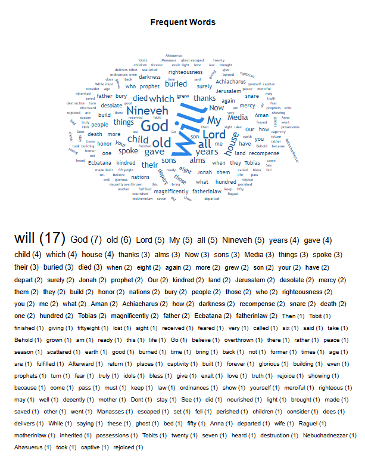

# 성경 책·장 단어 빈도 통계 설계

## 구현 상태

설계 완료, 미구현.

- book example: 창세기 책 화면 → 언급되는 단어들 통계 시각화 (책 단위)
- chapter example: 창세기 1장 화면 → 언급되는 단어들 통계 시각화 (장 단위)
- example view: 

| 범위 | 대상 화면 | 템플릿 | 진입 스크립트 |
|---|---|---|---|
| 책(BOOK) | 성경 장 목록 | `templates/bible/chapter-list.html` | `static/js/bible/chapter-list.js` |
| 장(CHAPTER) | 성경 구절 목록 | `templates/bible/verse-list.html` | `static/js/bible/verse-list.js` |

예시 이미지가 규정하는 산출물은 두 덩어리다. **(1) 빈도에 비례해 글자 크기가 달라지는 워드
클라우드**, **(2) 그 아래 `단어 (횟수)` 형태의 전체 빈도 목록**.

**구조 결정**: 요청마다 본문을 훑어 세지 않는다. **단어 어휘와 언급 횟수를 DB 테이블에 미리
넣어 두고, 관리자가 그 값을 관리한다.** 사용자 화면은 테이블을 읽기만 한다. 어휘의 출발점은
이미 있는 **성경 사전(`dictionary`) 데이터**이고, 사전에 없는 단어는 본문에서 후보를 뽑거나
외부 자료를 조사해 채운다.

---

## 0. 이 문서의 숫자는 어디서 나왔나

설계 전에 한국어 토큰화 프로토타입을 `db/seed/krv` (KRV 66권 전체)에 실제로 돌렸다. 아래 수치는
그 측정값이며 추정치가 아니다. 이 숫자들은 이제 **어휘 규모 산정과 재계산 배치 비용 산정**에
쓰인다.

| 측정 항목 | 값 |
|---|---|
| KRV 66권 전체 | 31,102절 / 464,151 어절 → 정규화 후 256,775 토큰 |
| 창세기 전체 | 1,533절 / 22,082 어절(고유 7,032) → 11,997 토큰(고유 **3,407**) |
| 창세기 1장 | 31절 / 421 어절(고유 197) → 228 토큰(고유 **85**) |
| 시편 전체(최대 분량 책) | 2,461절 / 26,753 어절 → 14,585 토큰(고유 3,895) |
| 시편 119편(최대 분량 장) | 1,658 어절 |
| 장별 고유 토큰 수(창세기 50개 장) | 최소 68 / 중앙값 134 / 평균 134 / 최대 255 |
| 말뭉치 전체 고유 토큰 | **28,641** (빈도 5회 이상은 6,093 — §3.5) |
| 1회만 등장하는 토큰 비율 | 약 60% |
| 정규화 처리 속도 | 어절당 1.7µs — KRV 66권 전체 0.78s (Python 기준, JVM 은 그 이하) |
| `dictionary` 테이블 | **313건, 전부 한국어** (운영 DB 실측) |

> KJV·NKRV 는 `db/seed/` 에 본문이 일부만 있어(`kjv/` 는 책 메타데이터뿐) KRV 를 기준 말뭉치로
> 삼았다. 운영 DB 에는 `BibleReader.getTranslations()` 가 노출하는 7개 번역본이 있다.

---

## 1. 요구사항

### 1.1 사용자 기능

1. 책 화면에서 **그 책 전체**에 등장하는 단어의 빈도 통계를 본다.
2. 장 화면에서 **그 장**에 등장하는 단어의 빈도 통계를 본다.
3. 워드 클라우드 + 빈도 목록 두 표현을 동시에 제공한다.
4. 비로그인 사용자도 볼 수 있다.
5. 단어를 누르면 **성경 사전 뜻**을 보거나 **그 단어로 성경 검색**으로 이동한다.

### 1.2 관리자 기능

1. 통계에 쓰이는 **단어 어휘를 등록·수정·비활성화**한다.
2. `창세기 / 하나님 / 225회` 처럼 **책·장별 언급 횟수를 직접 세팅**한다.
3. 본문을 스캔해 횟수를 **자동으로 채운 뒤 필요한 곳만 손본다**(전량 수기 입력은 불가능하다.
   §7.3 참조).
4. 어휘에 없는 단어 후보를 본문에서 뽑아 보고, 승인 또는 영구 제외한다.

### 1.3 비기능

- 사용자 조회는 인덱스 조회 2회(통계 + 재계산 시각)로 끝난다. 본문 스캔·형태소 분석이 요청 경로에 없다.
- 관리자가 값을 고치면 곧 반영된다(장시간 서버 캐시를 두지 않는다 — §9).
- 다크 테마·모바일(≥320px)·스크린리더 지원.

### 1.4 범위 밖

- 원어(히브리어/헬라어) 어휘 통계.
- 번역본 간 빈도 비교, 사용자별 통계, TF-IDF 등 가중치 지표.
- 형태소 분석기 도입(§4.2 참조).

---

## 2. 아키텍처 — 사전 집계 테이블 + 관리자 큐레이션

### 2.1 전체 파이프라인

```
[1] 어휘 확보                     [2] 카운트 채우기                [3] 서빙
┌──────────────────────┐     ┌───────────────────────┐    ┌──────────────────┐
│ dictionary 313건 가져오기│     │ 관리자: 재계산 실행      │    │ GET word-stats   │
│ 본문 후보 자동 추출      │ ──▶ │ 본문 스캔 → 어휘 매칭    │──▶ │ 인덱스 조회 1회    │
│ 외부 조사(사전에 없는 것) │     │ AUTO 행 DELETE + INSERT │    │ 워드클라우드 + 목록 │
│ 관리자 검수 → 승인/차단  │     │ 관리자: 개별 값 수정     │    └──────────────────┘
└──────────────────────┘     └───────────────────────┘
        ▲                                │
        └──── 미매칭 후보 리포트로 되먹임 ─────┘
```

핵심은 **[1]과 [2] 사이의 되먹임 고리**다. 본문에서 어휘에 매칭되지 않은 어절은 그대로 버려지지
않고 "후보 리포트" 로 관리자에게 돌아온다. 운영할수록 어휘가 촘촘해지고 통계가 정확해진다.

### 2.2 실시간 집계와 비교 — 무엇을 얻고 무엇을 잃는가

| | 요청 시 실시간 집계 | **테이블 + 관리자 큐레이션 (채택)** |
|---|---|---|
| 화면 품질 | 규칙이 놓친 활용형(`나뉘게`, `하려`)이 그대로 노출 | 승인된 어휘만 노출 — **쓰레기 단어가 원천적으로 없다** |
| 사전 연계 | 없음 | `dictionary` 와 연결 → 단어 클릭 시 뜻풀이 |
| 값 통제 | 코드를 고쳐야 바뀜 | 관리자가 화면에서 직접 수정 |
| 조회 비용 | 최대 46ms + CPU | 인덱스 조회 < 20ms(§11) |
| 저장 공간 | 0 | 번역본당 약 14.6만 행 · 2개 번역본이면 약 48MB(§5.5) |
| 새 번역본 추가 시 | 자동 반영 | **재계산을 돌려야 화면이 채워진다** |
| 초기 비용 | 없음 | 어휘 구축 작업이 선행돼야 한다 |
| 롱테일(1회 단어) | 자동으로 다 나옴 | 어휘에 없으면 안 보임 → §3.2 상태 모델로 보완 |

잃는 것은 **초기 구축 비용**과 **번역본 추가 시 재계산 의무**다. 얻는 것은 **확정된 품질**과
**사전 연계**, 그리고 **관리자 통제권**이다. 규칙 기반 한국어 정규화가 아무리 정교해도 100% 가
될 수 없다는 점(§4.2)을 감안하면, 사람이 최종 확인한 어휘만 내보내는 쪽이 제품으로서 안전하다.

### 2.3 정규화는 사라지지 않는다 — 역할만 바뀐다

테이블 방식이라고 해서 한국어 처리가 없어지는 것이 아니다. `하나님이`·`하나님의`·`하나님을`
을 모두 `하나님` 1회로 세려면 여전히 조사를 떼어야 한다. 달라지는 점은 **그 결과가 사용자에게
바로 노출되지 않는다**는 것이다.

- 정규화가 과하게 잘라 `종류대` 같은 형태가 나와도 → 어휘에 없으므로 **매칭 실패 → 화면에 안
  나옴** (후보 리포트에만 뜬다)
- 정규화가 덜 잘라 `땅에` 로 남으면 → `땅` 카운트가 낮아짐 → **후보 리포트에 `땅에` 가 뜨는
  것으로 정규화 규칙의 결함이 드러난다.** 1음절 명사 허용 목록(§4.2)에 `땅` 을 넣어 고친다.
  이런 종류는 별칭으로 때우지 않는다(§4.1)

즉 정규화 오류가 **화면 오류가 아니라 데이터 품질 지표**로 바뀌고, 고칠 수단이 코드 수정이
아니라 관리자 조작이 된다.

---

## 3. 어휘 사전 (`bible_word`)

### 3.1 어휘를 어디서 확보하는가 — 세 갈래

**(1) 성경 사전(`dictionary`) 가져오기 — 1차 씨앗**

운영 DB 실측: **313건, 전부 한국어 표제어**(`term ~ '[가-힣]'` 313/313), `original_language_code`
는 313건 모두 NULL, `bible_usage_count` 도 313건 모두 0 이다. 관리자 화면의 **"사전에서
가져오기"** 버튼으로 `bible_word` 에 일괄 등록하고 `dictionary_id` 로 연결한다.

- 이미 사람이 검수한 성경 용어이므로 **검수 없이 바로 APPROVED** 로 넣는다.
- `dictionary.bible_usage_count` 는 실측으로 전부 `0` 인 미사용 필드다. 재계산 시 이 필드를 전체
  성경 기준 합계로 채워 주면 사전 화면에서도 쓸 수 있다(Phase 2).
- **`original_language_code`(HEBREW/GREEK)는 표제어의 언어가 아니라 성경 원어다.** 이름이 비슷해
  혼동하기 쉬운데, 어휘 분류에 쓸 수 있는 값이 아니다. 게다가 313건 전부 NULL 이라 지금은 값도
  없다.

> 📌 **사전에 다른 언어가 들어오면 이 경로가 가장 먼저 영향을 받는다.** 아래 §3.6 참조.

**(2) 본문 후보 자동 추출 — 규모 확보**

§4.2 정규화 규칙으로 본문을 훑어 **어휘에 아직 없는 토큰**을 빈도순으로 뽑는다. 창세기만 해도
고유 토큰이 3,407개이므로, 사전 313건으로는 예시 이미지 같은 롱테일이 절대 나오지 않는다.
후보 추출이 어휘 규모를 만드는 주력이다.

**(3) 외부 조사 — 사전에도 본문 후보로도 안 잡히는 것**

인명·지명·도량형·제사 용어처럼 사전에 항목이 없는 단어는 외부 자료를 조사해 채운다. 작업
지침은 §3.4.

### 3.2 상태 모델 — 승인 / 후보 / 차단

`bible_word.status` 로 세 가지를 구분한다. 이것이 "쓰레기 단어" 문제와 "롱테일" 요구를 동시에
푸는 장치다.

| 상태 | 의미 | 화면 노출 |
|---|---|---|
| `APPROVED` | 관리자가 확인했거나 사전에서 가져온 어휘 | 항상 |
| `CANDIDATE` | 본문에서 자동 추출된 미검수 어휘 | **정책 스위치로 결정**(초기: 노출) |
| `BLOCKED` | 관리자가 영구 제외 (`나뉘게`, `하려` 같은 활용형 잔재) | 절대 안 나옴. **재추출해도 다시 후보로 올라오지 않는다** |

운영 흐름은 이렇다.

1. 초기: 사전 313건(APPROVED) + 자동 추출(CANDIDATE) 로 화면을 일단 채운다.
2. 관리자가 통계 화면을 보다가 이상한 단어를 발견하면 `BLOCKED` 로 내린다.
3. 좋은 단어는 `APPROVED` 로 올리며 설명·별칭을 채운다.
4. 시간이 지날수록 CANDIDATE 비중이 줄고 품질이 올라간다.

**`BLOCKED` 가 재추출을 막는다는 점이 중요하다.** 이 장치가 없으면 재계산할 때마다 같은 쓰레기
단어가 되살아나 같은 작업을 반복하게 된다.

### 3.3 별칭 (`bible_word_alias`)

한 표제어에 여러 표기가 붙는다.

| 유형 | 예 |
|---|---|
| 번역본 표기 차이 | `하나님` / `하느님` |
| 음역 차이 | `여호와` / `야훼` |
| 표기 변이 | `아브람` / `아브라함` (합칠지는 편집 판단) |
| 영어 복수형 | `heaven` / `heavens` (§4.5) |

> ⚠️ **조사 결합형(`땅에`, `땅을`)은 별칭이 아니다.** 그건 정규화 규칙의 결함이므로 §4.2 에서
> 고친다. 별칭에 밀어 넣기 시작하면 표제어 하나에 수십 개가 붙고 어느 조사를 빠뜨렸는지 알 수
> 없게 된다. 자세한 근거는 §4.1.

매칭은 **표제어와 별칭을 같은 해시 테이블에 넣고 조회**한다. 별칭을 추가하면 다음 재계산부터
그 표기가 표제어 카운트에 합산된다.

- `bible_word` 는 `language_code` 를 가진다. 어휘는 언어별로 별도다(`하나님` / `God` / `Dios`).
- 별칭은 **같은 언어 안에서 유일**해야 한다. 두 표제어가 같은 별칭을 가지면 어느 쪽으로 셀지
  결정할 수 없다. 저장 시 검증하고 `BIBLE_WORD_DUPLICATED` 로 막는다.

### 3.4 외부 조사 작업 지침

사전에도 없고 설명이 필요한 단어를 조사할 때의 규칙이다. 이 결과는 사용자에게 그대로 보이므로
느슨하게 다루면 안 된다.

- **기록 항목**: 표제어 / 분류(인물·장소·개념·사물·도량형) / 별칭 / 한 줄 설명 / 출처
- **설명은 자체 문장으로 쓴다.** 외부 사전이나 백과의 문장을 그대로 복사해 DB 에 넣으면 저작권
  문제가 된다. 내용을 확인한 뒤 직접 요약하고, 출처는 관리자 메모 용도로만 남긴다.
- **번역본 간 표기를 함께 확인한다.** KRV 와 NKRV 는 인명 표기가 다른 경우가 있다. 확인한
  표기는 별칭으로 등록한다.
- 조사해서 설명까지 만든 단어는 **`dictionary` 에도 등재**한다. 성경 사전 화면이 같이 좋아지고,
  다음에 다시 조사할 일이 없어진다.

### 3.5 어휘 규모 산정

KRV 66권 전체를 정규화한 결과 **고유 토큰은 28,641개**다. 임계값별 어휘 규모와 본문 커버리지는
아래와 같다(모두 측정값).

| 말뭉치 빈도 임계값 | 어휘 수 | 토큰 커버리지 | 성격 |
|---|---|---|---|
| 20회 이상 | 1,894 | — | 핵심 어휘만 |
| 10회 이상 | 3,464 | 79.8% | 상위권은 충분, 롱테일 없음 |
| **5회 이상** | **6,093** | **86.4%** | **1차 권장** |
| 3회 이상 | 9,436 | — | |
| 2회 이상 | 13,783 | 94.2% | 예시 이미지 수준의 롱테일 |
| 1회 이상(전량) | 28,641 | 100% | 검수 불가능한 규모 |

**권장 1차 목표는 빈도 5회 이상 6,093개**다. 사전 313건으로 시작하면 어휘의 5% 밖에 안 되므로,
후보 자동 추출이 규모를 만드는 주력이라는 점이 여기서 분명해진다.

> 이 표는 초안에서 "빈도 5회 이상 약 2,500개" 로 적었던 것을 실측으로 바로잡은 것이다. 실제
> 규모는 약 2.4배다. 검수 부담과 저장 용량(§5.5)이 모두 이 숫자에 비례하므로 계획 단계에서
> 실측값을 쓰는 것이 중요하다.

### 3.6 성경 사전 다국어화 대비

**성경 사전에 다른 언어를 넣고 `dictionary` 에 언어 컬럼을 추가하는 것이 확정된 계획이다.**
이 기능은 사전을 어휘의 씨앗으로 쓰므로 직접 영향을 받는다. 가정이 아니라 예정된 변경이므로,
**지금 코드가 무엇을 전제하고 있고 · 컬럼이 생길 때 무엇을 어떻게 바꾸는지**를 확정해 둔다.

#### 현재 `dictionary` 는 표제어 언어를 구분하지 못한다

실측으로 확인한 사실이다.

| 항목 | 현재 상태 |
|---|---|
| 표제어 언어 컬럼 | **없음** |
| `original_language_code` | `HEBREW`/`GREEK` 전용 — 성경 원어이지 표제어 언어가 아님. 313건 모두 NULL |
| 정렬 | `DictionaryRepository.findAllOrderByKo` 가 `ORDER BY term COLLATE "ko-KR-x-icu"` 로 **한국어 고정** |
| 검색 | `findByTermContainingKo` 도 같은 콜레이션. 언어 필터 없음 |
| 중복 검사 | `existsByExactTermIgnoreCase(term)` 가 **전체 테이블 대상** — 언어 구분 없음 |

즉 사전은 "한국어 전용" 이라고 코드에 박혀 있는 것이 아니라, **한국어만 들어온다는 가정 위에
동작**하고 있다. 다른 언어가 들어오는 순간 정렬·검색·중복 검사 세 곳이 조용히 잘못 동작한다
(예외가 나지 않고 결과만 틀린다).

#### 언어 컬럼이 추가될 때 — 이 기능이 바라는 형태

컬럼 설계는 `study` 모듈의 몫이지만, 이 기능이 사전을 참조하는 쪽이라 **맞춰 두면 좋은 사항**을
적어 둔다. 아래 형태면 통계 쪽에서 변환 없이 그대로 쓴다.

```sql
ALTER TABLE dictionary ADD COLUMN IF NOT EXISTS language_code VARCHAR(4);
UPDATE dictionary SET language_code = 'ko' WHERE language_code IS NULL;   -- 기존 313건
ALTER TABLE dictionary ALTER COLUMN language_code SET NOT NULL;

ALTER TABLE dictionary DROP CONSTRAINT IF EXISTS uk_dictionary_term;
ALTER TABLE dictionary ADD  CONSTRAINT uk_dictionary_term UNIQUE (language_code, term);
```

- **타입은 `LanguageCode`(nv-i18n) + `@Enumerated(STRING)` + `length = 4`.**
  `bible_translation.language_code` 와 `bible_word.language_code` 가 이미 같은 형태다. 셋이
  같은 타입이어야 "이 번역본의 언어로 어휘를 고르고, 그 언어의 사전 행에 연결한다" 가 변환 없이
  성립한다. `String` 이나 별도 enum 을 새로 만들면 경계마다 매핑 코드가 생긴다.
- **기존 313건은 `ko` 로 백필**한다. 전부 한국어임을 실측으로 확인했다(§3.1).
- **중복 검사를 `(language_code, term)` 로 바꾼다.** 지금 `existsByExactTermIgnoreCase` 는 전체
  테이블 대상이라, 언어가 다른 동형 표제어를 중복으로 막아 버린다.
- **콜레이션을 언어별로 분기**한다. `ORDER BY term COLLATE "ko-KR-x-icu"` 는 한국어일 때만
  옳다. 영어·스페인어 목록이 한국어 콜레이션으로 정렬되면 순서가 어긋난다.
- 목록·검색 쿼리에 **언어 필터**를 추가한다. 없으면 한국어 사전 화면에 영어 표제어가 섞인다.

> 위 다섯 가지는 이 기능의 범위 밖이지만, **하나라도 빠지면 예외 없이 결과만 조용히 틀리는**
> 종류의 변경이다(정렬 순서, 중복 판정, 목록 내용). 사전 다국어화 작업 시 체크리스트로 쓰면
> 좋겠다.

#### 이 설계가 이미 대비하고 있는 것

- `bible_word.language_code` 가 있고 유니크 제약이 `(language_code, term)` 이다(§5.1). 어휘는
  처음부터 언어별로 분리된다.
- `bible_word_alias` 의 유니크도 `(language_code, alias)` 다(§5.2).
- 불용어·조사·어미 규칙 파일이 언어별로 나뉘어 있다(§4.5, §6).
- 매칭 시 번역본의 `languageCode` 로 어휘를 고르므로, 한국어 어휘가 영어 번역본에 섞이지 않는다.

**즉 통계 쪽 스키마는 손댈 것이 없다.** 사전이 다국어가 될 때 바뀌는 것은 "사전 → 어휘" 가져오기
경로 하나뿐이다.

#### 가져오기 API 의 언어 처리

`POST /words/import-from-dictionary` 는 **`languageCode` 를 필수 파라미터로 받는다**(§7.2).
그 값이 그대로 `bible_word.language_code` 가 된다. 사전 쪽 필터는 두 단계로 간다.

| 시점 | 사전에서 가져올 행을 고르는 기준 |
|---|---|
| 언어 컬럼 추가 **전** (지금) | **문자 종류로 판별.** `languageCode=ko` 면 `term ~ '[가-힣]'` 인 행만. 현재 313건 전부 해당 |
| 언어 컬럼 추가 **후** | `dictionary.language_code = :languageCode`. **문자 판별 코드는 삭제한다** |

문자 판별은 **명시적으로 한시적인 코드**다. 언어 컬럼이 확정된 계획인 만큼 오래 남을 이유가
없고, 남으면 해롭다 — 라틴 문자를 쓰는 영어와 스페인어는 문자 종류로 서로 구분되지 않으므로
그때는 조용히 잘못 동작한다.

그래서 두 가지를 못 박는다.

1. **언어 컬럼이 생기기 전까지 `languageCode != ko` 가져오기를 거부한다**
   (`INVALID_PARAMETER`). 잘못 동작할 수 있는 경로를 아예 막아 둔다.
2. **판별 술어를 한 곳에만 둔다.** `DictionaryImportFilter` 같은 단일 지점에 격리해, 컬럼이
   생기면 그 한 곳만 교체하고 위 1번 제한을 푸는 것으로 전환이 끝나게 한다.

영어 어휘 구축은 어차피 Phase 3(§13)이라 이 제한이 일정을 막지 않는다.

`dictionary_id` 연결도 언어가 맞는 행에만 건다. 영어 `bible_word` "God" 이 한국어 사전의
`하나님` 행을 가리키면 사용자에게 엉뚱한 뜻풀이가 뜬다.

#### 다국어화가 주는 이득

사전이 다국어가 되면 **영어·스페인어 어휘 구축 비용이 크게 줄어든다.** §3.1 의 세 갈래 파이프
라인이 언어와 무관하게 그대로 재사용되고, 1차 씨앗을 사람이 처음부터 만들지 않아도 된다.
그래서 §13 Phase 3 의 "영어·스페인어 어휘 구축" 은 **사전 다국어화 이후에 착수하는 것이
합리적**이다. 순서를 뒤집으면 같은 작업을 두 번 하게 된다.

#### 하지 않는 것

`하나님` / `God` / `Dios` 를 하나의 개념으로 묶는 **언어 간 표제어 연결은 만들지 않는다.**
번역본 간 빈도 비교(§1.4 범위 밖)에나 필요한 것이고, 지금 만들면 어휘 등록마다 "이게 어느 개념
이냐" 를 정하는 부담이 생긴다. 나중에 필요해지면 `bible_word` 에 `concept_id` 를 추가하는
방식으로 뒤에 붙일 수 있다 — 언어별로 행이 분리돼 있으므로 기존 데이터를 옮길 필요가 없다.

---

## 4. 카운트 계산 규칙

관리자가 손으로 고치는 값이라도, **자동 계산이 만든 초안이 기준선**이다. 그래서 계산 규칙은
사용자에게 노출되는 "사실" 을 만드는 규칙이고 함부로 바꾸면 안 된다.

### 4.1 매칭 규칙

```
1. 절 본문을 어절로 자른다
2. 어절 원형을 어휘+별칭 해시에서 먼저 조회한다  → 매칭되면 확정, 3~4 를 건너뛴다
3. 매칭 안 되면 §4.2 규칙으로 정규화한다
4. 정규화 결과를 다시 해시에서 조회한다          → 매칭되면 확정
5. 매칭된 표제어가 BLOCKED 면 카운트도 후보 적립도 하지 않고 버린다 (§7.3 억제 집합)
6. 그 외 매칭이면 표제어 카운트를 1 증가
7. 끝내 매칭 안 되면 '미매칭 후보' 카운터에 적립 (§4.3)
```

- **정규화보다 원형 조회가 먼저다.** 순서가 반대이면 `바다`·`고기` 같은 2음절 명사가 어미
  규칙(§4.2)에 걸려 *정규화 단계에서 이미 버려진 뒤*라 조회할 것이 남지 않는다. 어휘에 등록된
  표제어는 어떤 규칙보다 우선한다.

  > 표제어 두 개가 원형/정규형으로 겹치면 원형이 이긴다. 예를 들어 `주` 와 `주의` 가 모두
  > 어휘에 있으면 어절 `주의` 는 `주의` 로 세고 `주` 로는 세지 않는다. 이런 겹침은 관리자가
  > 어휘를 만들 때 판단할 문제이고, 규칙은 예측 가능한 쪽(원형 우선)으로 고정한다.

  > ⚠️ 이 성질을 **조사 결합형을 별칭에 밀어 넣는 용도로 쓰면 안 된다.** `땅에`·`땅을`·`땅의`·
  > `땅으로` … 를 별칭으로 등록하기 시작하면 표제어 하나에 수십 개가 붙고, 어느 조사를 빠뜨렸는지
  > 아무도 알 수 없게 된다. **조사 때문에 못 세는 것은 정규화 규칙(§4.2)의 결함이고 거기서
  > 고쳐야 한다.** 별칭은 `하나님`/`하느님`, `여호와`/`야훼` 같은 **표기 자체가 다른 경우**에만
  > 쓴다. 관리자 화면의 별칭 입력란에도 이 안내 문구를 넣는다.
- 조회는 해시 O(1) 이다. 어휘가 1만 개여도 어절 수(46만)에만 비례한다 — 규칙을 단순 부분 문자열
  검색(`LIKE '%주%'`)으로 하면 `주` 가 `예수`·`주다`·`주의` 에 다 걸려 카운트가 망가진다.
  **부분 문자열 매칭은 쓰지 않는다.**
- 한 절에 같은 단어가 두 번 나오면 2로 센다(어절 단위 집계이므로 자연스럽게 그렇게 된다).

### 4.2 한국어 정규화 규칙

이 규칙은 이제 **카운트 계산기와 후보 추출기 안에서만** 쓰인다. 사용자 화면에 직접 노출되지
않는다.

**파이프라인**

```
1. 한글 외 문자 제거
2. 공백으로 어절 분할
3. 불용어면 버림
4. 서술어 어미로 끝나면 버림          (이르시되 → 버림)
5. 조사 제거 (긴 것 우선)             여호와께서 → 여호와,  모세에게 → 모세
6. 제거 후 3·4 를 한 번 더 적용        (땅에 → 땅 유지 / 때에 → 때 → 불용어라 버림)
7. 2음절 이상이거나 1음절 명사 허용 목록에 있으면 채택
```

**조사 목록(긴 것 우선)**

```
에게서 으로부터 에게로 이라고 이라는 께서는 에서는 으로는 으로써 으로서 이라도 에게는 한테는
께서 에게 한테 에서 으로 대로 만큼 처럼 보다 부터 까지 조차 마다 이나 이며 이고 이란 라도 에는 에도 이라
은 는 이 가 을 를 의 와 과 도 만 로 에 께 랑 야 여 아
```

반드시 긴 것부터 시도한다. `대로` 가 목록에 없으면 `종류대로` 에서 `로` 만 떨어져 `종류대` 가
된다(프로토타입 1차 시도에서 실제 관측). 가장 긴 조사가 길이 가드에 걸렸을 때 그대로 중단하지
말고 짧은 후보로 계속 시도해야 한다.

**1음절 명사 허용 목록**

조사를 뗀 줄기가 1음절이면 원칙적으로 버리되, 허용 목록에 있으면 살린다.

```
땅 빛 물 밤 낮 말 손 발 눈 입 피 불 산 강 집 문 길 떡 옷 양 소 새 왕 법 죄 복 뜻 힘 성 종 뱀
배 상 벌 은 금 술 밭 씨 잔 뼈 살 뜰 검 활 창 북 남 동 주 신 영 혼 돌 별 해 달 꿈 병 일 …
```

효과는 측정에서 확연하다. 목록이 없을 때 상위권은 `땅에(130)`·`주의(755)` 형태였고, 넣은 뒤
**땅(265)** / 시편 **주(1235)** 로 정리됐다. 시편의 `주`(주님)는 목록이 없으면 통째로 사라지는
최상위 단어였다.

**서술어 어미 목록** (명사가 그 꼬리로 끝나는 일이 거의 없는 것만)

```
3음절 이상: 니라 더라 리라 노라 도다 나니 으니 으며 하매 하니 하고 하여 하사 하신 하실 하는 하며
            되니 되며 되어 되고 로되 으되 았고 었고 았다 었다 한다 지라 이다 나이다 니이다 더니
            거늘 거든 있는 없는 하려 하되 지만 면서 으면 어서 아서 든지 던지 시니 시매 시고 시며
            시는 시기 시되 겠고 겠다 노니 사대 으라 이여 소서
2음절 전용: 는 니 며 고 게 지 되 면 서 어 아 자
```

2음절 목록은 `바다`·`고기`·`창고` 같은 명사를 잘못 버릴 위험이 있다. **어휘에 등록된 표제어는
이 규칙보다 먼저 확정**시켜 방어한다(§4.1 의 3번에서 원본 어절을 먼저 조회하는 이유).

**불용어**: 대명사(`그`, `우리`, `너희`, `내가`), 지시어(`이것`, `여기`), 접속·부사(`그리고`,
`또한`, `다시`), 의존명사(`것`, `수`, `때`, `곳`, `중`), 초고빈도 서술어(`가로되`, `이르되`,
`가라사대`), 수사.

**규칙을 쌓아 갈 때의 실제 개선 폭 (창세기 1장 상위 12개)**

| 단계 | 결과 |
|---|---|
| ① 정규화 없음 | 하나님이(22), 모든(12), 가라사대(10), 그(10), 종류대로(10), 하나님의(8), 땅에(8), 보시기에(7), 좋았더라(7), 저녁이(6), 되며(6), 아침이(6) |
| ② 조사 제거만 | 하나님(30), 되니(11), 가라사대(10), **종류대(10)**, 궁창(9), 하시(9), 땅에(8), 보시기(7), 좋았더(7), 저녁(6), 되며(6), 아침(6) |
| ③ + 어미·불용어 | 하나님(30), 종류(10), 궁창(9), 땅에(8), 보시기(7), 저녁(6), 되며(6), 아침(6), **그대(6)**, 맺는(6), 광명(6), 하늘(5) |
| ④ + 1음절 명사·재검사 | **하나님(30), 땅(18), 종류(10), 물(9), 궁창(9), 빛(6), 저녁(6), 아침(6), 씨(6), 광명(6), 하늘(5), 새(5)** |

④에서도 `나뉘게(4)`, `가진(3)` 같은 활용형이 남는다. **테이블 방식에서는 이것들이 어휘에
없으므로 화면에 나오지 않는다.** 후보 리포트에 뜨면 관리자가 `BLOCKED` 로 내리면 끝이다.

**형태소 분석기(KOMORAN/Kiwi)를 도입하지 않는 이유**: 사전 기반 분석기는 수십 MB 를 상주시키고
콜드 스타트를 늘린다. 이 저장소는 Spring Boot 4 / Jackson 3 / Testcontainers 2 로 이미 한 번
크게 흔들렸다(`tech-stack.md`). 게다가 큐레이션 구조에서는 정규화 오류가 화면에 새지 않으므로
분석기의 이득이 크게 줄어든다. 도입하게 되면 `BibleWordTokenizer` 한 클래스만 교체하고 재계산을
한 번 돌리면 된다.

### 4.3 미매칭 후보 리포트 — 자기 교정 고리

재계산할 때 매칭에 실패한 정규화 토큰을 빈도와 함께 모아 관리자에게 보여 준다. 이 화면이
어휘를 키우는 주 입구다.

```
창세기 미매칭 상위:  종류대(10)  나뉘게(4)  기는(4)  가진(3)  각기(3) ...
                    └ [어휘 등록]  [차단]  버튼
```

- 이미 `BLOCKED` 인 단어는 리포트에서 제외한다.
- 리포트 자체는 저장하지 않고 요청 시 계산한다(§7.2). 저장하면 또 하나의 낡은 데이터가 된다.

### 4.4 AUTO / MANUAL — 관리자 수정은 재계산에 지워지지 않는다

`bible_word_stat.source` 를 둔다.

| 값 | 생성 경로 | 재계산 시 |
|---|---|---|
| `AUTO` | 본문 스캔 결과 | 덮어씀 |
| `MANUAL` | 관리자가 직접 입력·수정 | **건드리지 않음** |

이 구분이 없으면 관리자가 공들여 고친 값이 다음 재계산 한 번에 사라진다. 관리자 화면에서는
`MANUAL` 행에 배지를 붙이고 "자동값으로 되돌리기" 를 제공한다(그 행을 지우고 다시 계산).

### 4.5 영어·스페인어

`BibleTranslation.languageCode` 로 분기한다.

- 소유격 `'s` 절단 → 소문자화 → 알파벳 외 제거 → 공백 분할
- 불용어에 **KJV 계열 고어(`thou`, `thee`, `hath`, `shalt`, `unto`)를 반드시 포함**한다. 일반
  영어 불용어 목록만 쓰면 이것들이 상위권을 덮는다.
- 어간 추출(stemming)은 하지 않는다. `blessed → bless` 처럼 표시 형태가 망가진다.
- 복수형은 **어휘 조회로 가드된 규칙**으로 처리한다. `-s`/`-es` 를 떼어 본 결과가 **어휘에 있을
  때만** 그 표제어로 센다(`heavens` → `heaven` ✓ / `moses` → `mose` 는 어휘에 없으므로 원형 유지).
  무조건 떼는 blind stemming 과 달리 오작동이 구조적으로 막힌다.

  > 복수형을 전부 별칭으로 등록하는 방법도 있지만, 영어 어휘가 6,000개 규모(§3.5)라 별칭도 수천
  > 개가 필요하고 빠뜨린 것을 알아낼 방법이 없다. 규칙 하나로 끝나는 일을 데이터로 옮기지
  > 않는다. 불규칙 복수(`men`, `feet`)만 별칭으로 등록한다.
- 스페인어(RVR1909/SBLM)는 같은 경로에 불용어 목록만 교체한다.

---

## 5. DB 설계

`db/README.md` 규칙을 따른다. 재실행 가능한 `CREATE ... IF NOT EXISTS`, 한국어 `COMMENT ON`,
타임스탬프는 `TIMESTAMP(6)`, `id` 는 `BIGINT GENERATED BY DEFAULT AS IDENTITY`.

### 5.1 `db/schema/bible_word.sql`

```sql
-- =====================================================================
-- bible_word
-- 성경 단어 빈도 통계 표제어 어휘 테이블
-- 설계 문서: docs/bible/word-frequency-design.md
-- 대상 DB: PostgreSQL 17
-- =====================================================================

CREATE TABLE IF NOT EXISTS bible_word (
    id            BIGINT       GENERATED BY DEFAULT AS IDENTITY PRIMARY KEY,
    term          VARCHAR(50)  NOT NULL,
    language_code VARCHAR(4)   NOT NULL,
    category      VARCHAR(20)  NOT NULL,          -- PERSON/PLACE/CONCEPT/OBJECT/MEASURE/ETC
    status        VARCHAR(20)  NOT NULL,          -- APPROVED/CANDIDATE/BLOCKED
    dictionary_id BIGINT       NULL,              -- 성경 사전 연결 (있으면 뜻풀이 노출)
    note          TEXT         NULL,              -- 조사 출처 등 관리자 메모 (사용자 비노출)
    created_at    TIMESTAMP(6) NOT NULL,
    updated_at    TIMESTAMP(6) NOT NULL,
    CONSTRAINT uk_bible_word_term_lang UNIQUE (language_code, term)
);

CREATE INDEX IF NOT EXISTS idx_bible_word_status
    ON bible_word (language_code, status);

COMMENT ON TABLE  bible_word               IS '성경 단어 통계 표제어 어휘';
COMMENT ON COLUMN bible_word.status        IS 'APPROVED=노출, CANDIDATE=미검수, BLOCKED=영구 제외';
COMMENT ON COLUMN bible_word.dictionary_id IS '성경 사전(dictionary) 연결. NULL 이면 뜻풀이 없음';
COMMENT ON COLUMN bible_word.note          IS '관리자 메모(조사 출처 등). 사용자에게 노출하지 않음';
```

`dictionary_id` 에 FK 제약을 걸지 않는다. 사전 항목이 지워져도 어휘와 통계는 살아 있어야 하고,
`bible` 모듈이 `study` 모듈 테이블에 물리 제약으로 묶이는 것도 피한다. **연결은 언어가 일치하는
사전 행에만 건다**(§3.6). 사전이 다국어가 되면 이 검증이 필수가 된다.

`category` 는 `NOT NULL` 이지만 **자동 추출된 후보는 분류를 알 수 없다.** 이런 행은 `ETC` 로
넣고, 관리자가 `APPROVED` 로 올릴 때 실제 분류를 지정한다. 즉 `category = ETC AND status =
CANDIDATE` 가 "아직 손대지 않은 후보" 를 뜻한다 — 관리자 목록의 기본 필터로 쓸 수 있다.

### 5.2 `db/schema/bible_word_alias.sql`

```sql
-- =====================================================================
-- bible_word_alias
-- 표제어 별칭·이형태 테이블
-- 설계 문서: docs/bible/word-frequency-design.md
-- 대상 DB: PostgreSQL 17
-- =====================================================================

CREATE TABLE IF NOT EXISTS bible_word_alias (
    id            BIGINT       GENERATED BY DEFAULT AS IDENTITY PRIMARY KEY,
    bible_word_id BIGINT       NOT NULL,
    alias         VARCHAR(50)  NOT NULL,
    language_code VARCHAR(4)   NOT NULL,
    created_at    TIMESTAMP(6) NOT NULL,
    updated_at    TIMESTAMP(6) NOT NULL,
    CONSTRAINT uk_bible_word_alias UNIQUE (language_code, alias)
);

CREATE INDEX IF NOT EXISTS idx_bible_word_alias_word
    ON bible_word_alias (bible_word_id);

COMMENT ON TABLE bible_word_alias IS '표제어 별칭·이형태 (같은 언어 안에서 유일해야 함)';
```

`language_code` 를 별칭 행에도 복제해 두는 이유는 유니크 제약을 언어 단위로 걸기 위해서다.
저장 시 부모 `bible_word.language_code` 와 같은 값인지 검증한다.

### 5.3 `db/schema/bible_word_stat.sql`

```sql
-- =====================================================================
-- bible_word_stat
-- 성경 책/장 단위 단어 언급 횟수 테이블
-- 설계 문서: docs/bible/word-frequency-design.md
-- 대상 DB: PostgreSQL 17
-- =====================================================================

CREATE TABLE IF NOT EXISTS bible_word_stat (
    id             BIGINT       GENERATED BY DEFAULT AS IDENTITY PRIMARY KEY,
    bible_word_id  BIGINT       NOT NULL,
    translation_id BIGINT       NOT NULL,
    book_order     INT          NOT NULL,
    chapter_number INT          NOT NULL,          -- 0 = 책 전체 집계
    word_count     INT          NOT NULL,
    source         VARCHAR(10)  NOT NULL,          -- AUTO / MANUAL
    CONSTRAINT uk_bible_word_stat
        UNIQUE (translation_id, book_order, chapter_number, bible_word_id)
);

CREATE INDEX IF NOT EXISTS idx_bible_word_stat_scope
    ON bible_word_stat (translation_id, book_order, chapter_number, word_count DESC);

CREATE INDEX IF NOT EXISTS idx_bible_word_stat_word
    ON bible_word_stat (bible_word_id);

COMMENT ON TABLE  bible_word_stat                IS '성경 책/장 단위 단어 언급 횟수';
COMMENT ON COLUMN bible_word_stat.chapter_number IS '장 번호. 0 이면 책 전체 집계';
COMMENT ON COLUMN bible_word_stat.source         IS 'AUTO=자동 계산, MANUAL=관리자 입력(재계산 시 보존)';
```

**`chapter_number` 를 nullable 로 두지 않는 이유**: PostgreSQL 유니크 제약에서 NULL 은 서로 다른
값으로 취급되어 중복 행이 그대로 들어간다. PG15+ 의 `UNIQUE NULLS NOT DISTINCT` 가 있지만
Hibernate 가 만드는 **테스트 스키마에는 반영되지 않아** 운영과 다르게 동작한다(`db/README.md` 가
경고하는 함정이다). 센티널 `0` 은 두 환경에서 동일하게 동작한다.

**책 전체 행(`chapter_number = 0`)을 따로 두는 이유**: 장 행을 `SUM` 하면 되지 않느냐고 할 수
있다. 그러나 요구사항이 "창세기에서 '하나님' 은 몇 번" 을 **관리자가 직접 세팅**하는 것이므로,
책 단위도 수정 가능한 실체 행이어야 한다. 자동 재계산 시에는 장 행의 합으로 채우고, 관리자가
고치면 `MANUAL` 로 보존된다.

**책 행은 상위 300개까지만 저장한다.** 조회 API 의 `limit` 상한이 300 이므로(§8.1) 그보다 하위
순위의 책 행은 어떤 화면에도 나올 수 없다. 실측으로 책당 매칭 어휘 종수는 중앙값 594 · 최대
2,383 이라, 이 절단만으로 책 행이 55,861 → 18,039 로 **68% 줄어든다**(§5.5). 절단된 단어의 책
합계가 필요하면 장 행을 `SUM` 해서 언제든 복원할 수 있으므로 정보 손실이 아니다.

`word_count = 0` 인 행은 저장하지 않는다. "안 나온 단어" 는 행의 부재로 표현한다.

**`created_at` / `updated_at` 을 두지 않는다.** 이 테이블은 번역본 수에 따라 수십만~100만 행
규모로 커지는데(§5.5), 행마다 타임스탬프 2개는 16B × 100만 ≈ 16MB 를 그냥 쓴다. 게다가 개별 행의 생성 시각은 아무도 보지
않는다. 필요한 것은 "이 범위를 언제 재계산했나" 하나뿐이므로 §5.4 의 메타 테이블에 따로 둔다.
따라서 엔티티는 `BaseTimeEntity` 가 아니라 **`BaseEntity` 를 상속**한다.

### 5.4 `db/schema/bible_word_stat_run.sql` — 재계산 이력

```sql
-- =====================================================================
-- bible_word_stat_run
-- 단어 통계 재계산 이력 테이블
-- 설계 문서: docs/bible/word-frequency-design.md
-- 대상 DB: PostgreSQL 17
-- =====================================================================

CREATE TABLE IF NOT EXISTS bible_word_stat_run (
    id             BIGINT       GENERATED BY DEFAULT AS IDENTITY PRIMARY KEY,
    translation_id BIGINT       NOT NULL,
    book_order     INT          NOT NULL,
    calculated_at  TIMESTAMP(6) NOT NULL,
    chapter_count  INT          NOT NULL,
    stat_row_count INT          NOT NULL,
    manual_kept    INT          NOT NULL,
    created_at     TIMESTAMP(6) NOT NULL,
    updated_at     TIMESTAMP(6) NOT NULL,
    CONSTRAINT uk_bible_word_stat_run UNIQUE (translation_id, book_order)
);

COMMENT ON TABLE  bible_word_stat_run             IS '단어 통계 재계산 이력 (번역본×책 단위 1행)';
COMMENT ON COLUMN bible_word_stat_run.manual_kept IS '재계산 시 보존한 MANUAL 행 수';
```

책당 1행이므로 번역본 7개여도 462행이다. 이 테이블이 세 가지를 한 번에 해결한다.

1. 사용자 응답의 `calculatedAt` 출처 (§8.3) — 통계 행에서 뽑을 수 없었던 값이다.
2. 관리자 목록에서 **번역본별 재계산 누락**을 눈에 띄게 하는 근거 (§7.4).
3. 재계산 결과 요약(처리 장 수, 갱신 행 수, 보존한 MANUAL 행 수)의 영속 기록.

### 5.5 규모 산정 — 실측

KRV 66권(1,189장)에 정규화를 돌려 **어휘별로 실제 매칭되는 행 수를 센 값**이다.

| 어휘 임계값 | 어휘 수 | 장 행 | 책 행(전량) | 책 행(상위 300 절단) | 번역본당 |
|---|---|---|---|---|---|
| 2회 이상 | 13,783 | 146,010 | 71,580 | 18,418 | **164,428** |
| **5회 이상** | **6,093** | **128,272** | 55,861 | **18,039** | **146,311** |
| 10회 이상 | 3,464 | 114,170 | 44,805 | 17,500 | 131,670 |

장당 매칭 어휘 종수는 빈도 5회 이상 기준 **중앙값 105 · 평균 108 · 최대 282** 다.

| 통계 제공 번역본 수 | 행 수(5회 이상 기준) | 예상 용량(행+인덱스 170B) |
|---|---|---|
| 2개 (KRV, NKRV — 한국어) | 약 29만 | 약 48MB |
| 3개 | 약 44만 | 약 71MB |
| 7개 (전체) | 약 102만 | 약 166MB |

> 초안에서는 "번역본당 약 58,000행 / 7개 확장 시 50MB" 라고 적었다. **실제는 약 2.5배, 용량은
> 3배 이상이다.** 초안의 "장당 30~60 종" 이라는 가정이 틀렸고(실제 중앙값 105), 특히 책 행을
> 6배 과소평가했다.

행당 170B 가정은 운영 DB 실측으로 검증했다. `bible_verse` 가 204,960행에 heap 40MB + 인덱스
11MB 이므로 인덱스 밀도가 유사한 수준이다.

**용량을 좌우하는 것은 장 행이고, 장 행은 줄일 방법이 마땅치 않다.** 장당 중앙값이 105 라
상위 N 절단이 거의 효과가 없고, 어휘 임계값을 10회로 올려도 번역본당 146,311 → 131,670행으로
**10% 밖에 안 줄면서** 커버리지는 86% → 80% 로 떨어진다. 실질적인 조절 레버는 **이 기능을 켤 번역본 수** 하나뿐이다.

### 5.6 운영 인스턴스 실측 — 제약은 디스크가 아니라 메모리다

운영 Supabase(`el-seeker`, ap-northeast-2, PostgreSQL 17.6)를 직접 조회한 값이다.

| 지표 | 값 |
|---|---|
| 디스크 | 1.9GB 중 **355.73MB 사용(18%)** — System + WAL + Database |
| 데이터베이스 크기 | **78MB** (`pg_database_size`) |
| `bible_verse` | **51MB** (heap 40MB + 인덱스 11MB), **204,960행** |
| 인스턴스 RAM | **435.66MB** — Used 207.91MB(47.7%) / Cache+Buffers 210.67MB(48.4%) / **Free 17.07MB(3.9%)** |
| Swap | **302.46MB 사용(69.4%)** |

여기서 두 가지가 드러난다.

**(1) 디스크는 제약이 아니다.** 7개 번역본 전부(+166MB)를 넣어도 522MB / 1.9GB ≈ 27% 다. 남은
여유가 1.5GB 이므로 디스크만 보면 고민할 일이 아니다. §5.5 를 "용량 문제" 로 쓴 것은 초점이
빗나간 것이었다.

**(2) 진짜 제약은 페이지 캐시다.** RAM 이 435MB 뿐이고 그중 캐시가 210MB 인데, **지금은 DB
전체(78MB)가 캐시에 다 들어간다.** 이 상태에서

- 2개 번역본(+48MB) → DB 126MB. 여전히 캐시(210MB) 안이다. **현재 성능 특성이 유지된다.**
- 7개 번역본(+166MB) → DB 244MB. **캐시를 넘어선다.** 통계 테이블이 `bible_verse` 와 캐시를
  두고 경쟁하기 시작한다. 이미 Free 메모리가 3.9%, Swap 이 69% 인 인스턴스다.

치명적이지는 않다. 조회가 인덱스 점 조회라 콜드 리드가 몇 ms 추가되는 수준이고, 자주 보는
책·장은 캐시에 남는다. 그러나 **여유가 없는 인스턴스에서 DB 를 3배로 키우는 판단**이라는 점은
분명히 인식하고 결정해야 한다.

**재계산 배치가 더 큰 순간 부하다.** 번역본 하나에 14.6만 행을 쓰면 WAL 이 생기고 더티 페이지가
캐시를 밀어낸다. 435MB 인스턴스에서는 그동안 읽기 성능이 눈에 띄게 나빠질 수 있다. **트래픽이
적은 시간대에 책 단위로 나눠 실행**한다(§7.3 의 책 단위 순차 호출 방식과 자연스럽게 맞는다).

→ **권장: 한국어 2개(KRV, NKRV)로 시작한다.** 근거는 세 가지다.

1. DB 가 캐시 안에 남는다(126MB < 210MB).
2. 어휘는 **언어 단위**라 KRV·NKRV 가 같은 어휘를 공유한다. 한국어 어휘 6,100개 하나만
   구축하면 두 번역본이 동시에 켜진다. 영어를 켜려면 영어 어휘 6,000여 개를 처음부터 다시
   구축해야 한다(§13 Phase 3).
3. 효과를 먼저 확인하고 확장 여부를 정할 수 있다.

> ⚠️ **초안의 "본문 보유 번역본 3개" 는 틀렸다.** `db/seed/` 에 KRV 만 전량 있어서 그렇게 적었는데,
> 운영 DB 의 `bible_verse` 는 204,960행으로 **7개 번역본이 이미 다 들어 있다**(31,102 × 6.6).
> 즉 7개 시나리오는 가정이 아니라 언제든 실행 가능한 현재 상태이고, 그래서 "몇 개를 켤 것인가" 가
> 실제 결정 사항이다.

### 5.7 적용 순서

`db/schema/` 는 배포 직전에 사람이 직접 적용한다. 순서는 `bible_word` → `bible_word_alias` →
`bible_word_stat` → `bible_word_stat_run`.

```bash
psql "$DATABASE_URL" -f db/schema/bible_word.sql
```

---

## 6. 도메인 구조

```
bible/
├─ adapter/input/api/client/BibleWordStatApi.kt                -- 사용자 조회
├─ adapter/input/api/client/BibleWordStatApiDocument.kt
├─ adapter/input/api/client/response/BibleWordStatResponse.kt
├─ adapter/input/api/admin/AdminBibleWordApi.kt                -- 어휘 CRUD
├─ adapter/input/api/admin/AdminBibleWordApiDocument.kt
├─ adapter/input/api/admin/AdminBibleWordStatApi.kt            -- 카운트 관리·재계산
├─ adapter/input/api/admin/AdminBibleWordStatApiDocument.kt
├─ adapter/input/api/admin/request/AdminBibleWordRequest.kt
├─ adapter/input/api/admin/request/AdminBibleWordStatRequest.kt
├─ adapter/input/api/admin/response/AdminBibleWordCandidateResponse.kt
├─ adapter/input/web/admin/AdminBibleWebController.kt          -- 화면 4개 추가
├─ adapter/output/jpa/BibleWordRepository.kt
├─ adapter/output/jpa/BibleWordAliasRepository.kt
├─ adapter/output/jpa/BibleWordStatRepository.kt
├─ adapter/output/jpa/BibleWordStatRunRepository.kt            -- calculatedAt 조회·재계산 이력
├─ adapter/output/jpa/BibleVerseRepository.kt                  -- 본문 조회 메서드 2개 추가
├─ application/component/BibleWordTokenizer.kt                 -- 정규화 (순수 함수, DB 없음)
├─ application/component/BibleWordMatcher.kt                   -- 어휘 해시 조회 + 카운트 집계
├─ application/component/DictionaryImportFilter.kt             -- 사전→어휘 언어 판별 (§3.6, 한시적)
├─ application/component/WordStatRules.kt                      -- 불용어/조사 리소스 로딩
├─ application/service/BibleWordStatService.kt                 -- 사용자 조회
├─ application/service/AdminBibleWordService.kt                -- 어휘 CRUD
├─ application/service/AdminBibleWordStatService.kt            -- 재계산·수정·후보 리포트
├─ domain/model/BibleWord.kt                                   -- BaseTimeEntity 상속
├─ domain/model/BibleWordAlias.kt                              -- BaseTimeEntity 상속
├─ domain/model/BibleWordStat.kt                               -- BaseEntity 상속 (§5.3 참조)
├─ domain/model/BibleWordStatRun.kt                            -- BaseTimeEntity 상속
├─ domain/vo/BibleWordCategory.kt                              -- PERSON/PLACE/CONCEPT/...
├─ domain/vo/BibleWordStatus.kt                                -- APPROVED/CANDIDATE/BLOCKED
├─ domain/vo/BibleWordStatSource.kt                            -- AUTO/MANUAL
└─ domain/result/BibleWordStatResult.kt                        -- WordFrequencyStat 을 같은 파일에 둔다

src/main/resources/word-stats/
├─ stopwords-ko.txt   josa-ko.txt   verb-tails-ko.txt   one-char-nouns-ko.txt
└─ stopwords-en.txt   stopwords-es.txt
```

**엔티티는 세터를 두지 않는다**(`naming.md`). 상태 변경은 의도가 드러나는 메서드로 한다.

```kotlin
class BibleWord(...) : BaseTimeEntity(id = id) {
    fun approve()
    fun block()
    fun linkDictionary(dictionaryId: Long)
    fun updateDetail(command: BibleWordUpdateCommand)
}

class BibleWordStat(...) : BaseEntity(id = id) {
    fun updateByAdmin(count: Int)   // source 를 MANUAL 로 전환
}
```

`BibleWordStat` 에 "자동값으로 덮어쓰기" 메서드가 없는 것은 의도적이다. AUTO 행은 재계산 때
범위 단위로 지우고 다시 넣으므로(§7.3) 개별 행을 갱신할 일이 없다. 엔티티가 제공하는 유일한
변경 수단이 `updateByAdmin` 이라는 사실 자체가 "AUTO 행은 손으로 고치지 않는다" 는 규칙을
코드에서 강제한다.

새로 필요한 `ErrorType` 은 3개다. 나머지는 기존 항목(`INVALID_PARAMETER`,
`TRANSLATION_NOT_FOUND`, `BOOK_NOT_FOUND`, `CHAPTER_NOT_FOUND`)으로 충분하다.

```kotlin
// 404
BIBLE_WORD_NOT_FOUND(HttpStatus.NOT_FOUND, "단어를 찾을 수 없습니다.", LogLevel.WARN),
BIBLE_WORD_STAT_NOT_FOUND(HttpStatus.NOT_FOUND, "단어 통계를 찾을 수 없습니다.", LogLevel.WARN),
// 409
BIBLE_WORD_DUPLICATED(HttpStatus.CONFLICT, "이미 등록된 단어 또는 별칭입니다.", LogLevel.WARN),
```

---

## 7. 관리자 기능

### 7.1 화면

기존 관리자 규약을 그대로 따른다. `AdminBibleWebController` 에 매핑을 추가하고,
`templates/admin/bible/` 에 `admin-table` + `admin-card-list` 구조의 템플릿을 만든다.
사이드바는 `admin/fragments/admin-sidebar.html` 의 **study 그룹**(번역본 / 책 개요 / 사전)에
넣는다.

| 경로 | 템플릿 | 내용 |
|---|---|---|
| `/web/admin/bible/words` | `admin-bible-word-list.html` | 어휘 목록. 상태·분류·언어 필터, 검색, 사전 연결 여부 표시 |
| `/web/admin/bible/words/new`, `/{id}/edit` | `admin-bible-word-form.html` | 어휘 등록·수정. 별칭 편집, 사전 연결, 상태 변경 |
| `/web/admin/bible/word-stats` | `admin-bible-word-stat-list.html` | 번역본·책·장 선택 → 카운트 목록. 인라인 수정, `MANUAL` 배지, 재계산 버튼 |
| `/web/admin/bible/word-candidates` | `admin-bible-word-candidate-list.html` | 미매칭 후보 목록. 행마다 [어휘 등록] / [차단] |

- 목록 화면 상단 툴바에 **"사전에서 가져오기"**, **"재계산"** 버튼을 둔다.
- JS 는 `admin-common.js` 의 `fetchAdmin`, `handleDelete`, `confirmDelete` 를 쓴다. 관리자
  요청은 인증이 필요하므로 `fetchWithAuthRetry` 기반인 `fetchAdmin` 을 반드시 경유한다.
- 카운트 목록은 행이 많다 — **장 단위 중앙값 105행, 책 단위는 상위 300 절단 상한까지**(§5.5).
  페이지네이션은 기존 관리자 화면과 같이 `PageRequest` 로 처리한다.

### 7.2 API

모두 `/api/v1/admin/**` 이므로 `SecurityConfig` 에서 이미 `hasRole("ADMIN")` 이다. 별도 설정
변경이 필요 없다.

**어휘 (`AdminBibleWordApi`, `/api/v1/admin/bible/words`)**

| Method | Path | 설명 |
|---|---|---|
| `GET` | `` | 목록 (status/category/languageCode/term 필터, 페이지네이션) |
| `GET` | `/{id}` | 상세 (별칭 포함) |
| `POST` | `` | 등록 (별칭 동시 등록) |
| `PUT` | `/{id}` | 수정 |
| `PATCH` | `/{id}/status` | `APPROVED` / `CANDIDATE` / `BLOCKED` 전환 |
| `DELETE` | `/{id}` | 삭제 — 연결된 `bible_word_stat` 행도 함께 삭제 |
| `POST` | `/import-from-dictionary?languageCode=ko` | `dictionary` 일괄 가져오기. 이미 있으면 건너뜀(멱등). `languageCode` 필수 — 현재는 `ko` 만 허용(§3.6) |
| `POST` | `/bulk` | 후보 일괄 등록 (초기 구축용 — 6,100건 규모, §7.4) |

**`PATCH /{id}/status` 로 `BLOCKED` 로 내리면 그 어휘의 `bible_word_stat` 행을 즉시 삭제한다.**
재계산을 기다리면 차단한 단어가 그때까지 화면에 계속 보인다. `idx_bible_word_stat_word` 로
`DELETE FROM bible_word_stat WHERE bible_word_id = ?` 한 번이면 끝난다.

**`DELETE /{id}` 는 FK 가 없으므로 애플리케이션 코드가 통계 행을 직접 지워야 한다.**(§5.1 에서
`dictionary_id` 와 마찬가지로 물리 FK 를 걸지 않았다.) 지우려는 어휘에 `MANUAL` 통계 행이 붙어
있으면 관리자가 손으로 넣은 값이 함께 사라지므로, 삭제 전에 **"MANUAL 행 N건이 함께 삭제됩니다"
경고**를 띄운다. 대부분의 경우 삭제보다 `BLOCKED` 가 옳은 선택이다.

**카운트 (`AdminBibleWordStatApi`, `/api/v1/admin/bible/word-stats`)**

| Method | Path | 설명 |
|---|---|---|
| `GET` | `?translationId=&bookOrder=&chapterNumber=` | 카운트 목록 |
| `POST` | `` | 행 직접 추가 (`source = MANUAL`) |
| `PATCH` | `/{id}` | 값 수정 (`source` 를 `MANUAL` 로 전환) |
| `DELETE` | `/{id}` | 행 삭제 (자동값으로 되돌리기) |
| `POST` | `/recalculate` | 재계산. `translationId` 필수, `bookOrder` 선택(없으면 번역본 전체) |
| `GET` | `/candidates?translationId=&bookOrder=&limit=` | 미매칭 후보 리포트 |

`DELETE /{id}` 는 "삭제" 라기보다 **자동값 복원**이다. 관리자 화면 버튼 라벨도 그렇게 쓴다.

### 7.3 재계산 동작과 성능

```
1. 대상 범위의 어휘 + 별칭을 한 번에 로드해 해시 맵 구성   (1만 개여도 수 MB)
   -- BLOCKED 어휘는 '집계용 해시'가 아니라 별도 '억제 집합'에 넣는다 (아래 설명)
2. 대상 책의 본문을 장 단위로 조회 (텍스트 컬럼만)
3. §4.1 매칭 규칙 적용(원형 조회 → 실패 시 정규화 후 재조회) → (장, 표제어) 카운터 누적
4. 해당 책 범위의 source = AUTO 행을 DELETE          ← UPSERT 가 아니다 (아래 설명)
5. 3의 결과 중 MANUAL 행이 이미 있는 (장, 표제어) 는 건너뛰고 나머지를 배치 INSERT
6. 책 행(chapter_number = 0) 은 장 행 최종값(MANUAL 포함)의 합으로 계산 →
   상위 300개만 4·5 와 같은 방식으로 반영
7. bible_word_stat_run UPSERT (calculated_at, 처리 장 수, 행 수, 보존한 MANUAL 수)
8. 미매칭 토큰은 응답의 후보 목록으로 반환 (저장하지 않음)
```

**1번에서 BLOCKED 를 '버리지 않고 억제 집합에 담는' 이유**: 그냥 로드하지 않으면 그 단어의
어절이 아무 데도 매칭되지 않아 **8번의 미매칭 후보로 다시 올라온다.** 차단한 단어가 재계산마다
후보 목록에 되살아나면 §3.2 가 약속한 "재추출해도 다시 올라오지 않는다" 가 깨지고, 관리자는
같은 단어를 무한히 다시 차단하게 된다. 그래서 BLOCKED 표제어·별칭도 조회는 하되, 맞으면
**카운트도 후보 적립도 하지 않고 그냥 버린다.**

**4번이 UPSERT 가 아니라 DELETE + INSERT 인 이유**: UPSERT 만 하면 *더 이상 매칭되지 않는 단어의
낡은 AUTO 행이 영구히 남는다.* 어휘를 `BLOCKED` 로 내리거나 별칭을 고쳐 매칭이 달라진 경우가
정확히 그렇다. 이번 계산 결과에 없는 행을 지울 방법이 없으므로, 범위 단위로 지우고 다시 넣는
편이 단순하고 정확하다. `MANUAL` 행은 DELETE 조건에서 제외되므로 그대로 살아남는다.

**6번에서 책 합계를 장 행의 "최종값" 으로 계산하는 이유**: 관리자가 어떤 장의 값을 손으로 고쳤다면
책 합계도 그 값을 반영해야 한다. 자동 계산 결과만 더하면 관리자가 보기에 앞뒤가 맞지 않는다.

| 구간 | 측정·추정 | 근거 |
|---|---|---|
| 본문 조회(창세기 1,533절) | < 50ms | 텍스트 컬럼 단일 프로젝션 |
| 정규화 + 해시 매칭(창세기 22,082 어절) | < 40ms | 어절당 1.7µs(Python), JVM 은 그 이하 |
| DELETE + 배치 INSERT(창세기 약 5,600행) | 수백 ms | 실측 장 행 기준(§5.5) |
| **책 1권 재계산** | **1초 안팎** | |
| **번역본 전체(66권, 46만 어절, 약 14.6만 행)** | **10초 내외** | 토큰화는 수 초, 나머지는 쓰기 비용 |

**번역본 전체 재계산은 HTTP 요청 타임아웃 경계에 있다.** 토큰화 자체는 수 초지만 14.6만 행을
쓰는 비용이 지배적이라 10초를 넘길 수 있다. 그래서 관리자 화면의 기본 동작은 **책 단위 재계산**
으로 하고, 번역본 전체 버튼은 책을 순차 호출하며 진행률을 보여 주는 방식으로 만든다. 서버에
비동기 작업 인프라를 들이지 않으면서 타임아웃도 피한다.

**트랜잭션 경계는 책 단위**로 끊는다. 번역본 전체를 한 트랜잭션으로 묶으면 수만 행이 한 번에
잠기고 중간 실패 시 전부 롤백된다.

> ⚠️ **자기 호출 함정**: "번역본 전체" 를 서버에서 처리한다면, 책 단위 `@Transactional` 메서드를
> 같은 빈의 루프에서 호출하면 안 된다. Spring AOP 프록시를 거치지 않아 **트랜잭션이 하나로
> 합쳐진다**(캐시 `@Cacheable` 자기 호출과 같은 원리). 루프와 책 단위 메서드를 서로 다른 빈으로
> 분리하거나 `TransactionTemplate` 을 쓴다. 위 권장안(클라이언트가 책 단위로 순차 호출)을 따르면
> 요청 자체가 분리되므로 이 문제가 생기지 않는다.

### 7.4 초기 구축 순서 (운영 작업)

1. 스키마 4개 적용(§5.7)
2. `POST /words/import-from-dictionary?languageCode=ko` — 사전 313건 등록
3. `GET /word-stats/candidates?translationId=1` (책 미지정 = 전체) 로 후보 확인
4. 빈도 5회 이상 후보를 일괄 `CANDIDATE` 로 등록 — **약 6,100개**(§3.5 실측)
5. `POST /word-stats/recalculate?translationId=1&bookOrder=N` 을 책 단위로 66회 실행
6. 사용자 화면에서 창세기·시편·요한복음을 열어 눈으로 확인
7. 이상한 단어를 `BLOCKED` 로 내리고 5번 재실행
8. 6~7을 만족할 때까지 반복 후 배포

4번은 6,100건 일괄 등록이므로 화면에서 한 건씩 누를 수 없다. **후보 목록의 "빈도 N회 이상 일괄
등록" 기능이 필요하다**(§7.2 의 `POST /words/bulk` 에 해당). 이것이 없으면 초기 구축이 사실상
불가능하다.

**신규 번역본을 추가할 때마다 5번을 다시 돌려야 한다.** 잊으면 그 번역본에서는 통계가 빈다.
관리자 목록 화면에 `bible_word_stat_run.calculated_at` 을 번역본×책 단위로 표시해 누락을 눈에
띄게 한다.

---

## 8. 사용자 조회 API

### 8.1 엔드포인트

| Method | Path | 설명 |
|---|---|---|
| `GET` | `/api/v1/bibles/translations/{translationId}/books/{bookOrder}/word-stats` | 책 단위 |
| `GET` | `/api/v1/bibles/translations/{translationId}/books/{bookOrder}/chapters/{chapterNumber}/word-stats` | 장 단위 |

쿼리 파라미터: `limit` (1~300, 기본 100)

`SecurityConfig` 는 `/api/v1/bibles/**` 를 `permitAll` 로 열어 두고 그 앞에서 메모·형광펜 경로만
개별적으로 `authenticated()` 로 잡는다. `word-stats` 는 그 목록에 없으므로 **SecurityConfig 수정
불필요**.

### 8.2 조회 쿼리

```kotlin
@Query(
    """
    SELECT new com.elseeker.bible.domain.result.WordFrequencyStat(
        w.term, s.wordCount, w.dictionaryId
    )
    FROM BibleWordStat s
    JOIN BibleWord w ON w.id = s.bibleWordId
    WHERE s.translationId = :translationId
      AND s.bookOrder = :bookOrder
      AND s.chapterNumber = :chapterNumber
      AND w.status IN :statuses
    ORDER BY s.wordCount DESC, w.term
    """
)
fun findStats(
    @Param("translationId") translationId: Long,
    @Param("bookOrder") bookOrder: Int,
    @Param("chapterNumber") chapterNumber: Int,
    @Param("statuses") statuses: Collection<BibleWordStatus>,
    pageable: Pageable,
): List<WordFrequencyStat>
```

- `chapterNumber = 0` 이면 책 단위 조회가 된다. 별도 메서드가 필요 없다.
- `idx_bible_word_stat_scope` 가 `(translation_id, book_order, chapter_number, word_count DESC)`
  이므로 **범위 선택과 정렬은 인덱스로 해결된다.** 다만 `w.status` 필터가 조인 대상 테이블에
  있어 커버링 인덱스로 끝나지는 않는다. 인덱스 순서대로 읽으면서 조인·필터 후 `LIMIT` 에서
  멈추는 형태가 된다. 장당 행이 중앙값 105개(§5.5)라 어차피 전량을 읽어도 부담이 없다.
- **정렬 2차 기준을 `term` 오름차순으로 고정한다.** 동률 순서가 매번 달라지면 워드 클라우드
  배치가 새로고침마다 바뀌어 버그처럼 보인다.
- `statuses` 는 노출 정책(§3.2)에 따라 `[APPROVED]` 또는 `[APPROVED, CANDIDATE]` 를 넘긴다.
  정책 값은 `application.yml` 프로퍼티로 둔다(`el-seeker.word-stats.include-candidate`).
- **`limit + 1` 개를 조회한다.** 응답의 `truncated`(§8.3)를 판정하려면 잘렸는지 알아야 하는데,
  이를 위해 별도 `COUNT` 쿼리를 한 번 더 도는 것은 낭비다. `limit + 1` 개를 받아 초과분이 있으면
  `truncated = true` 로 두고 마지막 하나를 버린다.
- `calculatedAt` 은 이 쿼리로 얻을 수 없다. `bible_word_stat_run` 을 `(translationId, bookOrder)`
  로 한 번 더 조회해 채운다(책당 1행이라 비용이 없다).

### 8.3 응답

```json
{
  "bookName": "창세기",
  "chapterNumber": 1,
  "shownCount": 228,
  "truncated": false,
  "calculatedAt": "2026-08-22T01:20:00Z",
  "items": [
    { "rank": 1, "word": "하나님", "count": 30, "dictionaryId": 12 },
    { "rank": 2, "word": "땅",     "count": 18, "dictionaryId": null },
    { "rank": 3, "word": "종류",   "count": 10, "dictionaryId": null }
  ]
}
```

- `dictionaryId` 가 있으면 프론트가 뜻풀이 링크를 붙인다(§10.5).
- **`shownCount` 는 반환된 `items` 의 카운트 합**이다. 범위 전체의 합이 아니다 — 그것을 구하려면
  `SUM` 쿼리를 한 번 더 돌아야 하는데 화면 어디에도 쓰이지 않는다. `totalCount` 라고 이름 붙이면
  "전체 합" 으로 읽히므로 쓰지 않는다.
- `truncated` 는 `limit + 1` 조회에서 초과분이 있었는지로 판정한다(§8.2). **범위 전체의 고유 단어
  수(`distinctCount`)는 응답에 넣지 않는다.** 별도 `COUNT` 쿼리가 필요한데, 목록 하단 문구를
  "상위 100개만 표시" 로 쓰면 그 값이 없어도 된다(§10.4).
- ⚠️ **책 단위는 저장 시점의 절단도 `truncated` 에 반영해야 한다.** 책 행은 상위 300개만
  저장하므로(§5.3), `limit=300` 요청은 300행을 받고 초과분이 없어 `truncated = false` 가 된다.
  그러나 실제로는 저장 단계에서 이미 잘렸다(책당 고유 어휘 중앙값 594). 조회 결과가 저장 상한
  300과 같으면 **책 단위에 한해 `truncated = true` 로 둔다.** 정확히 300개인 책에서 한 번
  과보고되지만, "더 있는데 없다고 말하는" 쪽보다 안전하다.
- **글자 크기용 가중치는 서버가 주지 않는다.** 폰트 크기는 화면 폭에 따라 달라지는 표현 계층의
  문제이고, `items[0].count` 가 최댓값이므로 클라이언트가 정규화한다.
- 통계가 아직 없으면(재계산 미실행) `items` 가 빈 배열이고 `calculatedAt` 이 `null` 이다.
  **404 가 아니다.** 이때 화면 동작은 §10.1 에 정의한다(진입 버튼은 그대로 두고 다이얼로그에서
  안내한다).

---

## 9. 캐시 전략

**서버 로컬 캐시(Caffeine)를 두지 않는다.**

- 조회가 인덱스 조회 2회 + 100~300행이라 캐시로 아낄 것이 거의 없다.
- 더 중요한 이유: **관리자가 값을 고쳤을 때 바로 보여야 한다.** `caching.md` 가 지적하듯 로컬
  캐시는 인스턴스마다 따로 존재하고 `@CacheEvict` 로 신뢰성 있게 비울 수 없다. 관리자가 수정한
  값이 인스턴스마다 다르게 보이는 상황은 이 기능에서 실제로 사람을 헷갈리게 만든다.

**HTTP 캐시는 1시간**으로 둔다.

```kotlin
private val wordStatCacheControl = CacheControl.maxAge(1, TimeUnit.HOURS).cachePublic()
```

`BibleApi` 의 다른 조회는 하루(`maxAge(1, DAYS)`)지만, 그쪽은 사람이 고치지 않는 본문 데이터다.
**단어 통계는 관리자가 편집하는 데이터이므로 하루는 너무 길다.** 1시간이면 CDN·브라우저 캐시
효과는 충분히 얻으면서 편집 반영 지연도 견딜 만하다.

부하가 문제가 되면 그때 캐시를 넣되, TTL 은 편집 반영 지연을 감안해 **분 단위**로 잡는다.

---

## 10. 프론트엔드 설계

### 10.1 진입 버튼

**책 화면 (`chapter-list.html`)** — `.book-action-buttons` 에 5번째 버튼을 추가한다.

```html
<button id="wordStatsBtn" class="book-action-btn" type="button" aria-label="단어 통계">
    <span class="book-action-btn-icon" aria-hidden="true">📊</span>
    <span class="book-action-btn-label">통계</span>
</button>
```

버튼은 `flex: 1`, `padding: 10px 8px`, `gap: 6px`, 아이콘 `0.95rem`, 라벨 `0.85rem`(2글자 ≈
27px)이라 최소 폭이 약 64px 이다.

| 화면 폭 | 버튼당 폭 | 판정 |
|---|---|---|
| 375px | (375−24)/5 ≈ 70px | 통과 |
| 360px | (360−24)/5 ≈ 67px | 빠듯하게 통과 |
| 320px | (320−24)/5 ≈ 59px | **넘침** |

→ `@media (max-width: 360px)` 에서 `padding: 10px 4px`, 라벨 `0.78rem` 로 줄이는 규칙을 함께
추가한다. 넣지 않으면 구형 기기에서 버튼이 줄바꿈되거나 잘린다.

**장 화면 (`verse-list.html`)** — 기존 `장 메모` / `읽음` 옆에 3번째 버튼을 넣는다.
`.flex-half` 는 이름과 달리 `flex: 1 1 0` 이라 3개가 되면 자동으로 1/3 씩 나눠 가진다. CSS
변경 없이 동작하지만 이름이 거짓말이 되므로 `.flex-equal` 로 함께 바꾸는 것을 권한다(사용처는
`verse-list.html` 두 곳뿐).

**통계가 없어도 버튼은 그대로 둔다.** 초안에는 "통계가 없으면 버튼을 숨긴다" 고 적었는데, 그러려면
**모든 장·책 화면이 로드될 때마다 통계 API 를 미리 한 번씩 호출**해야 한다. 아무도 통계를 안 여는
경우에도 요청이 나가므로 비용이 맞지 않는다. 버튼은 항상 노출하고, 눌렀을 때 결과가 비어 있으면
다이얼로그 안에 "아직 집계되지 않았습니다" 를 표시한다. 조회 요청은 사용자가 버튼을 누른 뒤에만
발생한다.

### 10.2 공용 모듈 구조

| 파일 | 역할 |
|---|---|
| `templates/fragments/word-stats-dialog.html` | `<dialog>` 마크업 (`fragments/confirm-dialog` 와 같은 `th:replace` 방식) |
| `static/js/bible/word-stats.js` | `initWordStats({ triggerId, buildEndpoint, buildTitle })` 하나만 export |
| `static/css/bible/word-stats.css` | 다이얼로그·클라우드·목록 스타일 |

`chapter-list.js` / `verse-list.js` 는 각자의 state(`translationId`, `bookOrder`,
`chapterNumber`)로 엔드포인트를 만들어 넘기기만 한다.

- **별도 페이지가 아니라 `<dialog>`**: 새 라우트·SEO 메타 없이 읽던 맥락을 유지한다. 이미
  `bookMemoPanel`, `chapterMemoPanel`, `popularSearchDialog` 라는 같은 패턴이 셋 있다. 스크롤
  잠금은 `common-util.js` 의 `setupDialogScrollLock(dialog)` 를 쓴다.
- **Bootstrap JS 는 없다.** `data-bs-toggle` / `new bootstrap.Modal()` 은 동작하지 않는다.
  네이티브 `<dialog>.showModal()` 로 연다.
- **조회는 인증이 필요 없다.** `fetchWithAuthRetry` 가 아니라 `popular-search.js` 와 같은
  형태(`fetch` + `credentials: "omit"` + `AbortController` 5초 타임아웃)를 쓴다.

### 10.3 워드 클라우드 배치 알고리즘

라이브러리를 쓰지 않는다. 번들러가 없고 `admin-analytics-visitors.js` 도 SVG 차트를 직접 그린다.

```
1. 표시 개수 N       폭 < 400px → 25,  < 700px → 35,  그 외 45
                     (전체 목록이 §10.4 에 그대로 있으므로 클라우드는 줄여도 정보 손실이 없다)
2. 폰트 크기         size = MIN + (MAX - MIN) * sqrt(count / maxCount)
                     MIN 0.75rem, MAX 2.5rem (모바일 2.0rem)
                     -- sqrt 를 쓰는 이유: 사람은 글자를 '면적'으로 인지한다. 선형 비례로
                        키우면 최상위 단어만 압도적으로 커져 2~5위가 뭉개진다.
3. 크기 측정         offscreen canvas 의 measureText 로 폭·높이를 잰다.
                     DOM 에 붙여 측정하면 N 회 강제 리플로우가 발생한다.
4. 배치              빈도 내림차순으로 중앙에서 나선을 그리며 자리를 찾는다.
                       angle += 0.15;  r = 4 * angle
                       x = cx + r * cos(angle) * ASPECT;  y = cy + r * sin(angle)
                     기존 사각형들과 AABB 충돌 검사 → 충돌 없으면 확정
                     시도 800회 초과 시 그 단어는 클라우드에서 생략(목록에는 남는다)
5. 뷰박스            배치 결과 bounding box 로 viewBox 를 정해 컨테이너 폭에 맞춘다
6. 색상              빈도 4구간 → 다크 테마 토큰 4단계
```

최악의 연산량은 45단어 × 800시도 × 45충돌검사 ≈ 160만 회 AABB 비교로 20ms 안에 끝난다.

- `ResizeObserver` 로 폭 변화 시 재배치하되 **디바운스 200ms**.
- `prefers-reduced-motion: reduce` 면 등장 애니메이션을 끈다.
- canvas 측정이 실패하는 환경에서는 `display: flex; flex-wrap: wrap` 흐름 배치로 폴백한다.

### 10.4 빈도 목록

예시 이미지의 아래쪽 영역이다. `단어 (횟수)` 를 빈도 내림차순으로 흐름 배치하고, 글자 크기는
클라우드보다 완만한 3~4단계로만 구분한다.

- 항목은 `<a>` 이고 실제 링크를 가진다. 클라우드가 아니라 **이 목록이 접근성의 본체**다.
- `truncated` 가 참이면 목록 끝에 `상위 100개만 표시` 를 회색 문구로 붙인다. 전체 개수는 응답에
  없다(§8.3 — 그 값을 위해 `COUNT` 쿼리를 추가할 만한 이유가 없다).
- 장 단위는 매칭 어휘가 중앙값 105개(§5.5)라 기본 `limit = 100` 에서 대부분 `truncated` 가 참이
  된다. 롱테일을 다 보여 주고 싶다면 장 화면에서는 `limit = 300` 으로 요청한다.

### 10.5 단어를 누르면 — 검색과 뜻풀이

큐레이션 구조라서 가능해진 기능이다. 단어마다 `dictionaryId` 가 함께 오므로 두 갈래를 제공한다.

| 조건 | 동작 |
|---|---|
| `dictionaryId` 있음 | 작은 팝오버로 사전 뜻 요약 + `사전에서 보기` / `이 단어로 검색` 두 버튼 |
| `dictionaryId` 없음 | 바로 검색으로 이동 |

- 사전 조회는 기존 `GET /api/v1/study/dictionaries/{id}` 를 쓴다. 새 API 가 필요 없다.
- 검색 이동: `/web/bible/search?keyword={word}&translationId={id}&bookOrder={n}`
- 표제어는 대부분 어절의 접두 부분이라(`하나님` ⊂ `하나님이`) 기존 검색의 `LIKE '%키워드%'` 와
  잘 맞는다.
- **`search.js` 보완이 필요하다.** 현재 검색 화면은 URL 에서 `keyword` 와 `translationId` 만
  읽고 `bookOrder` 는 화면 필터로만 설정된다. URL 의 `bookOrder` 를 읽어 필터 초기값으로
  반영해야 "창세기 안에서 '하나님' 검색" 이 링크 한 번으로 된다. 사용자 화면과 함께 가는
  변경이므로 **Phase 2 에 포함한다**(§13).
- 검색 API 는 `page == 0` 일 때 인기 검색어를 집계한다. 여기서 유입된 검색도 사용자의 실제
  검색이므로 집계 대상으로 둔다(`track=false` 를 붙이지 않는다).

### 10.6 접근성

- 클라우드 `<svg>` 에 `role="img"` + 요약 `aria-label`
  (예: `"창세기 1장 상위 25개 단어 워드클라우드. 가장 많이 나온 단어는 하나님 30회"`).
  내부 `<text>` 는 `aria-hidden="true"`, 포커스 대상 제외(`tabindex="-1"`).
- 같은 단어를 클라우드와 목록에서 두 번 읽히게 하면 스크린리더 사용자에게 소음이다.
  **접근 경로는 §10.4 목록 하나로 통일한다.**
- `<dialog>` 는 열릴 때 닫기 버튼으로 포커스를 옮기고, `Esc` 로 닫히며, 닫힌 뒤 트리거 버튼으로
  포커스를 되돌린다.
- 빈도는 색이 아니라 **크기**로 표현한다. 색은 보조 수단이다.

### 10.7 다크 테마 · hover

- 색상은 전부 `theme.css` 토큰(`--color-text-primary`, `--color-bg-elevated`, `--color-accent`,
  `--color-border`, `--color-text-secondary`)으로 참조한다. raw hex 금지.
- 다크 배경에서 대비가 3:1 아래로 떨어지지 않도록 가장 흐린 단계는 `--color-text-secondary`
  까지만 내린다.
- hover 효과는 반드시 `@media (hover: hover) and (pointer: fine)` 안에 둔다(`frontend.md`).

### 10.8 캐시 버스팅

CSS/JS 를 수정하면 참조 템플릿의 `?v=` 를 **전부** 올려야 한다.

| 파일 | 현재 | 변경 후 |
|---|---|---|
| `templates/bible/chapter-list.html` → `chapter-list.css` | `v=5.2` | `v=5.3` |
| `templates/bible/chapter-list.html` → `chapter-list.js` | `v=3.5` | `v=3.6` |
| `templates/bible/verse-list.html` → `verse-list.css` | `v=6.9` | `v=7.0` |
| `templates/bible/verse-list.html` → `verse-list.js` | `v=4.9` | `v=5.0` |
| `static/css/bible/word-stats.css` (신규) | — | `v=1.0` |
| `static/js/bible/word-stats.js` (신규) | — | `v=1.0` |
| `static/js/bible/search.js` (§10.5 보완) | 참조 템플릿 확인 후 +0.1 | |
| `static/css/admin/admin.css` (관리자 화면 추가 시) | `v=5.1` | `v=5.2` |

`head` 프래그먼트의 `extraCss` 는 쉼표로 여러 개를 받는다(`#strings.arraySplit`).

```html
th:replace="~{fragments/head :: head('성경 구절 읽기 - 본문 보기 | ElSeeker', true,
             '/css/bible/verse-list.css?v=7.0,/css/bible/word-stats.css?v=1.0')}"
```

---

## 11. 성능 예산

| 구간 | 예산 | 근거 |
|---|---|---|
| 사용자 조회(장/책) | **< 20ms** | 범위 인덱스 탐색 + 100~300행 조인 |
| 재계산 — 책 1권 | 1초 안팎 | 본문 조회 50ms + 매칭 40ms + 약 5,600행 쓰기 |
| 재계산 — 번역본 전체(66권) | 10초 내외 | 약 14.6만 행 쓰기가 지배적 (§7.3) |
| 클라우드 배치(45단어) | < 20ms | 최악 160만 AABB 비교 |

사용자 경로에서 본문 스캔이 사라진 것이 이 구조의 가장 큰 이득이다.

---

## 12. 테스트 계획

`testing.md` 원칙 그대로 — **단위 테스트를 두껍게, 통합 테스트는 최소로.**

### 단위 (Spring 컨텍스트 없음)

1. `BibleWordTokenizer` 조사 제거: `여호와께서` → `여호와`, `모세에게` → `모세`,
   `종류대로` → `종류` (**긴 조사 우선 회귀 방지 핵심**)
2. 1음절 명사 허용 목록: `땅에` → `땅`, `주의` → `주`, 반면 `것을` 은 버려질 것
3. `BibleWordMatcher` — 별칭으로 등록한 표기가 표제어 카운트에 합산될 것
4. `BibleWordMatcher` — `BLOCKED` 단어는 매칭도 후보 리포트도 되지 않을 것
5. 한 절에 같은 단어가 두 번 나오면 2로 셀 것
6. 영어: 소문자화, `thou`/`hath` 제거, 3자 미만 제거
7. `WordStatRules` 로딩 실패 시 기동 실패(빈 목록으로 조용히 통과하지 않을 것)
8. 정렬 안정성: 동률일 때 표제어 오름차순으로 항상 같은 순서

### 골든 테스트

창세기 1장 31절 텍스트를 **문자열 픽스처로 박아 넣고**, 어휘를 고정한 상태에서 상위 10개가
`하나님(30), 땅(18), 종류(10), 물(9), 궁창(9), 빛(6), 저녁(6), 아침(6), 씨(6), 광명(6)` 임을
검증한다. 규칙이나 불용어를 손댈 때마다 여기서 회귀가 잡힌다.

> DB 를 타지 않는 순수 문자열 배열이어야 한다. 시드 데이터에 의존하면 테스트
> 스키마(`ddl-auto: update`)에는 성경 본문이 없어 곧바로 깨진다.

### 통합 (`IntegrationTest` 상속, 최소 4건)

1. **재계산 멱등성** — 같은 범위를 두 번 재계산해도 행 수와 값이 같을 것
2. **MANUAL 보존** — 관리자가 값을 고친 뒤 재계산해도 그 행이 유지될 것 (이 설계의 핵심 계약)
3. **낡은 AUTO 행 제거** — 어휘를 `BLOCKED` 로 내리고 재계산하면 그 단어의 AUTO 행이 남지 않을 것
   (§7.3 이 UPSERT 가 아니라 DELETE + INSERT 인 이유를 고정하는 테스트다. UPSERT 구현으로
   되돌아가면 여기서 깨진다.)
4. 사용자 조회 1건 — 어휘·통계 삽입 → 호출 → 정렬과 `truncated` 판정 확인

`@MockBean`·`@DirtiesContext`·클래스별 `@TestPropertySource` 는 쓰지 않는다(컨텍스트 캐시가
깨진다).

---

## 13. 구현 순서

### Phase 1 — 데이터와 관리자

1. `db/schema/` **4개** 파일 작성 (§5) — `bible_word` / `bible_word_alias` / `bible_word_stat` /
   `bible_word_stat_run`
2. 엔티티 **4개** + VO 3개 + Repository **4개**
3. `word-stats/*.txt` 규칙 리소스 + `WordStatRules` 로더(빈 목록이면 기동 실패)
4. `BibleWordTokenizer` + 단위 테스트 + 골든 테스트
5. `BibleWordMatcher` (어휘 해시 + 카운트 집계 + 미매칭 수집)
6. `BibleVerseRepository` 본문 조회 메서드 2개
7. `AdminBibleWordService` / `AdminBibleWordStatService`
8. `AdminBibleWordApi` / `AdminBibleWordStatApi` + 각 `ApiDocument`
9. `ErrorType` 3개 추가
10. 관리자 화면 4개 + 사이드바 메뉴 + `AdminBibleWebController` 매핑
11. 통합 테스트 4건(§12)
12. **운영 초기 구축 실행 (§7.4)** — 여기까지 끝나야 사용자 화면을 만들 의미가 있다

### Phase 2 — 사용자 화면

1. `BibleWordStatService` + `BibleWordStatApi` + `ApiDocument`
2. `word-stats.css` / `word-stats.js` / `fragments/word-stats-dialog.html`
3. `chapter-list.html` · `verse-list.html` 버튼 + 320~360px CSS 보정
4. 단어 클릭 → 사전 팝오버 / 검색 이동 (§10.5)
5. `search.js` — URL `bookOrder` 파라미터 반영
6. `?v=` 일괄 갱신 (§10.8)

### Phase 3 — 다듬기

1. 롱테일 어휘 보강 (빈도 2회 이상까지 확장)
2. `dictionary.bible_usage_count` 를 재계산 시 함께 갱신
3. **성경 사전 다국어화가 끝난 뒤** 영어·스페인어 어휘 구축 (§3.6 — 순서를 뒤집으면 1차 씨앗을
   손으로 만들었다가 사전에서 다시 가져오는 이중 작업이 된다). 본문은 이미 7개 번역본 모두
   DB 에 있다(§5.6).
4. 딥링크(`#word-stats` 해시로 다이얼로그 자동 열기)

---

## 14. 결정이 필요한 열린 질문

1. ~~통계를 제공할 번역본을 몇 개로 할 것인가?~~ → **운영 실측으로 결론이 나왔다(§5.6).**
   디스크는 1.9GB 중 18%(355MB)로 여유가 충분해 제약이 아니었고, 진짜 제약은 **RAM 435MB
   인스턴스의 페이지 캐시 210MB** 였다. 2개(+48MB)면 DB 가 캐시 안에 남고, 7개(+166MB)면
   넘어선다. **한국어 2개(KRV, NKRV)로 시작**한다. 어휘가 언어 단위라 이 둘은 하나의 어휘를
   공유한다는 점도 같은 방향이다.
2. **`CANDIDATE` 를 사용자 화면에 노출할 것인가?** 노출하면 예시 이미지 같은 롱테일이 바로
   나오지만 미검수 단어가 섞인다. 숨기면 깔끔하지만 초기에는 상위 몇 개만 나오는 빈약한 화면이
   된다. 이 문서는 **프로퍼티 스위치로 두고 초기에는 노출**하는 쪽으로 설계했다.
3. **1차 어휘 규모를 어디까지 잡을 것인가?** §3.5 실측 기준 빈도 5회 이상이 6,093개다. 10회
   이상으로 올리면 3,464개로 줄지만 본문 커버리지가 86% → 80% 로 떨어지고, 저장 용량은 10% 밖에
   안 줄어 이득이 작다.
4. **책 단위 행을 관리자가 직접 고쳤을 때 장 행 합과 어긋나는 것을 허용할 것인가?**
   요구사항대로 직접 세팅을 허용하면 `SUM(장) ≠ 책` 이 될 수 있다. 관리자 화면에서 불일치를
   경고로 표시할지, 아예 막을지 결정이 필요하다. 참고로 책 행 상위 300 절단(§5.3) 때문에
   **하위 순위 단어는 애초에 책 행이 없다** — 이건 불일치가 아니라 설계된 부재다.
5. **번역본별 어휘를 따로 관리할 것인가, 언어별로 공유할 것인가?** 현재 설계는 언어별 공유다.
   KRV 와 NKRV 는 표기가 달라 별칭으로 흡수하는데, 번역본별로 완전히 분리하면 정확하지만 관리
   부담이 두 배가 된다.
