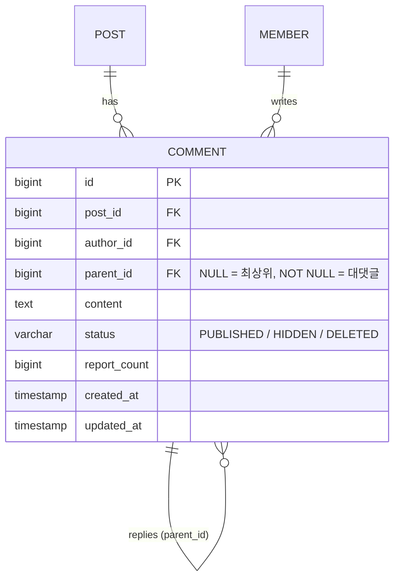

# 커뮤니티 대댓글 — 댓글에 답글 달기

## 1. 기능 목적

커뮤니티 댓글은 현재 **평면 구조**다. 모든 댓글이 작성 시각순으로 일렬 나열되어,
특정 댓글에 직접 답하면 그 답이 목록 맨 아래에 떨어져 **대화 맥락이 끊긴다.**

대댓글(댓글의 댓글)을 도입해 "어떤 댓글에 대한 답인지"를 시각적으로 묶어, 토론·질문·기도 요청
같은 게시글 유형에서 자연스러운 대화 흐름을 만든다.

핵심 가치: **댓글에 답글을 달아 맥락이 연결된 대화를 제공한다.**

설계 원칙(확정):
- **2단계 고정 중첩** — 댓글(부모) → 대댓글(자식) 1단계까지만. 대댓글에 다는 답글도 모두 같은 부모 아래로 평탄화한다. (인스타그램/유튜브 방식)
- **즉시 로드(상한 포함)** — 부모 댓글 페이지를 조회할 때 그 자식 대댓글도 함께 가져와 펼쳐 보여주되, 부모당 대댓글 로드 수에 상한을 둔다(4-2-2, H5 대응).

> **성공 기준(수용 기준)**: 사용자가 임의 댓글에 답글을 달면 새로고침 없이 부모 아래에 표시되고,
> 재진입 시에도 동일 구조로 보인다. 댓글 수 라벨은 항상 서버 `Post.commentCount`(PUBLISHED 기준)와 일치한다.

---

## 2. 사용자 흐름

```
게시글 상세 진입
  └─ 댓글 목록 조회 (최상위 댓글 Slice + 각 댓글의 대댓글 동봉, 부모당 상한 N)
       └─ 댓글의 "답글" 버튼 클릭
            └─ 해당 댓글 아래 인라인 답글 입력창 노출
                 └─ 내용 작성 후 "등록"
                      └─ 부모 댓글 아래 들여쓰기로 대댓글 추가 (부분 갱신)
```

- 대댓글에서 다시 "답글"을 눌러도 **작성 대상은 최상위 부모 1개**다(2단계 평탄화). 따라서 자식의
  자식은 생기지 않고, 모두 같은 부모 아래에 순서대로 쌓인다.
- 누구에게 답하는지는 MVP에서는 들여쓰기 위치로만 표현한다. `@닉네임` 멘션 프리픽스는 2차(5절·9절 참고).
- 인증·닉네임 요건은 기존 댓글 작성과 동일하다(로그인 + 닉네임 필요).
- **대댓글은 PUBLISHED 상태의 최상위 댓글에만 달 수 있다.** 부모가 HIDDEN/DELETED면 작성 차단(7-2).

---

## 3. 데이터 모델 설계

### 3-1. 접근 방식

기존 `community_comment` 테이블에 **자기참조 인접 리스트(adjacency list)** 컬럼 `parent_id`를 추가한다.
별도 테이블을 만들지 않으므로 수정/신고/권한검증 등 기존 댓글 로직 대부분을 그대로 재사용할 수 있다.
(삭제·조회·관리자 목록은 대댓글 도입에 따른 변경이 필요하다 — 4·7·8절 참고)

| 구분 | 조건 |
|------|------|
| 최상위 댓글 | `parent_id IS NULL` |
| 대댓글 | `parent_id = {부모 댓글 id}` (그 부모는 항상 최상위 댓글) |

**2단계 불변식**: 대댓글의 `parent_id`가 가리키는 댓글은 반드시 최상위 댓글이어야 한다.
사용자가 대댓글에 답글을 달면, 그 대댓글의 `parent_id`(= 조부모이자 실제 최상위)로 재지정해 평탄화한다.
이 규칙은 서비스 레이어에서 강제한다(7-1 참고).

### 3-2. ERD



### 3-3. 엔티티 변경안 (`community/domain/model/Comment.kt`)

기존 `Comment`에 자기참조 연관관계를 추가한다. 기존 생성자는 `content`/`status`/`reportCount` 뒤,
`createdAt`/`updatedAt` **앞**에 `parent`(기본값 `null`)를 둔다. 기본값이 있으므로 기존 `create()`
호출부는 깨지지 않는다.

```kotlin
class Comment(
    id: Long? = null,
    // post, author, content, status, reportCount … (기존과 동일)

    @ManyToOne(fetch = FetchType.LAZY)
    @JoinColumn(name = "parent_id")          // nullable: 최상위 댓글이면 null
    val parent: Comment? = null,

    createdAt: Instant = Instant.now(),
    updatedAt: Instant = Instant.now(),
) : BaseTimeEntity( … )
```

`@Table` 인덱스 블록에도 대댓글 조회 인덱스를 추가한다(로컬 H2/테스트 패리티 — Med4).

```kotlin
@Table(
    name = "community_comment",
    indexes = [
        Index(name = "idx_comment_post_created_at",   columnList = "post_id, created_at"),
        Index(name = "idx_comment_author_created_at", columnList = "author_id, created_at"),
        Index(name = "idx_comment_parent_created_at", columnList = "parent_id, created_at"), // 신규
    ]
)
```

팩토리 메서드 분리:

```kotlin
companion object {
    fun create(post: Post, author: Member, content: String) =
        Comment(post = post, author = author, content = content,
                status = CommentStatus.PUBLISHED, parent = null)

    fun createReply(post: Post, author: Member, content: String, parent: Comment) =
        Comment(post = post, author = author, content = content,
                status = CommentStatus.PUBLISHED, parent = parent)
}

fun isReply(): Boolean = parent != null
```

- 자식 개수(`replyCount`)는 **별도 컬럼 없이 count 쿼리로 산출**한다(MVP). 트래픽이 커지면 2차에서
  `reply_count` 비정규화 컬럼을 검토한다(9절).
- 수정/상태변경/신고/권한검증(`updateBy`, `registerReport`, `ensureEditableBy` 등)은 부모/자식 구분
  없이 그대로 재사용한다. **삭제(`deleteBy`/`delete`)만 부모 삭제 시 자식 처리 로직이 추가된다**(7-3).

### 3-4. DDL (PostgreSQL 17 기준)

> 운영 DB는 `ddl-auto: none`이므로 아래 마이그레이션을 수동 적용한다. 로컬/테스트(H2)는
> JPA가 스키마(컬럼 + `@Index`)를 자동 생성하므로 별도 작업이 필요 없다.

```sql
-- =====================================================================
-- community_comment : 대댓글(자기참조) 지원 컬럼 추가
-- 설계 문서: docs/community/community-reply-design.md
-- 대상 DB: PostgreSQL 17
-- =====================================================================

ALTER TABLE community_comment
    ADD COLUMN parent_id BIGINT NULL;

-- 자기참조 FK. ON DELETE 절을 두지 않는다(삭제는 soft-delete 전용 — 7-3·7-4 참고).
ALTER TABLE community_comment
    ADD CONSTRAINT fk_comment_parent
        FOREIGN KEY (parent_id) REFERENCES community_comment (id);

COMMENT ON COLUMN community_comment.parent_id
    IS '부모 댓글 ID (NULL=최상위 댓글, NOT NULL=대댓글). 2단계 고정: 부모는 항상 최상위 댓글';

-- =====================================================================
-- 인덱스 : 부모별 대댓글을 작성순으로 일괄 조회 (parent_id IN (:ids))
-- =====================================================================

CREATE INDEX IF NOT EXISTS idx_comment_parent_created_at
    ON community_comment (parent_id, created_at);
```

- 기존 인덱스 `idx_comment_post_created_at(post_id, created_at)`는 최상위 댓글 페이징에 그대로 활용된다.
  (최상위 조회에 `parent_id IS NULL` 조건이 추가되며, 필요 시 부분 인덱스로 최적화 가능 — 9절)

---

## 4. 데이터 조회 방향

### 4-1. 현재 상태

`CommentRepository.findByPostIdWithAuthor`가 게시글의 **모든 댓글을 평면으로** `created_at ASC` Slice 조회한다.
부모/자식 구분이 없어 대댓글을 묶어 보여줄 수 없다.

```kotlin
// AS-IS — 평면 전체 조회
fun findByPostIdWithAuthor(postId, status, pageable): Slice<Comment>
```

> 참고: `JOIN FETCH c.author`는 `@ManyToOne`(단일값) 페치라 Slice 페이징과 함께 SQL 레벨에서 정상
> 동작한다(컬렉션 페치가 아니므로 in-memory 페이징 경고 `HHH000104` 없음). 신규 쿼리도 동일하다.

### 4-2. 신규 조회 전략 (bounded fanout + count, 즉시 로드)

대댓글을 부모와 함께 펼쳐 보여주되, **최상위 페이징 1회 + 부모당 bounded 미리보기 팬아웃 + count 1회**로 조립한다.
(초안의 "2-쿼리" 표현은 부정확 — MVP 방식 A는 부모 수만큼 bounded 조회가 추가된다. Low 재지적 반영.)

**4-2-1. 최상위 댓글만 페이징** — 대댓글을 제외하고 부모만 Slice로 가져온다.

```sql
SELECT c FROM Comment c
JOIN FETCH c.author
WHERE c.post.id = :postId
  AND c.parent IS NULL
  AND c.status = :status          -- PUBLISHED
ORDER BY c.createdAt ASC, c.id ASC   -- tie-breaker(동일 시각 안정 정렬)
```

> **삭제된 부모 처리(C2 해결)**: MVP에서는 부모 삭제 시 자식까지 **cascade soft-delete**(7-3)하므로,
> 이 쿼리를 `status = PUBLISHED`로 단순 유지해도 고아 대댓글이 발생하지 않는다.
> "삭제된 댓글입니다" 자리표시 + 자식 유지 방식은 카운트 괴리(H1)와 `EXISTS` 서브쿼리 복잡도를
> 동반하므로 **2차로 미룬다**(9절에 정확한 JPQL 포함).

**4-2-2. 해당 페이지 부모들의 대댓글 조회(부모당 DB-side 상한 N)** — 위에서 얻은 부모 id 집합의 자식을 가져오되, **반드시 DB 레벨에서 부모당 N개로 제한**한다.

> **무제한 로드 실질 차단(High — 재지적 반영)**: 단순 `WHERE c.parent.id IN (:parentIds)`로 전량을 가져온 뒤
> 서비스에서 자르는 방식은 **DB에서 이미 무제한 로드**가 되어 상한이 무의미하다. 부모 하나에 대댓글이
> 수천 개면 그대로 메모리에 올라온다. 따라서 다음 둘 중 하나로 **DB-side에서 바운드**한다.
>
> **방식 A (MVP 기본) — 부모별 bounded Slice 팬아웃**: 페이지 부모(≤ page size, 예 20개) 각각에 대해
> `findRepliesByParentId(parentId, PUBLISHED, PageRequest.of(0, N))`를 `createdAt ASC, id ASC`로 호출한다. 쿼리 수는
> 페이지당 부모 수로 **상한이 보장**되고(≤ 20회), 각 쿼리는 `idx_comment_parent_created_at`로 `LIMIT N`만 읽어 저렴하다.
>
> ```kotlin
> val repliesByParent: Map<Long, List<Comment>> = parentIds.associateWith { pid ->
>     commentRepository.findRepliesByParentId(pid, PUBLISHED, PageRequest.of(0, REPLY_PREVIEW_SIZE)).content
> }
> ```
>
> **방식 B (최적화) — 윈도우 함수 단일 native 쿼리**: `ROW_NUMBER() OVER (PARTITION BY parent_id ORDER BY created_at)`로
> 부모당 N개를 한 번에 뽑는다. 단일 왕복이라 효율적이나 native SQL이며 author 매핑을 별도 처리해야 한다.
> 부모/자식 규모가 커지면 B로 전환한다(9절).
>
> 어느 방식이든 **잘린 나머지는 `replyCount`(4-2-3)로 총 개수를 알리고 4-2-4 on-demand로 더 불러온다.**

**4-2-3. 대댓글 수 집계** — 각 부모의 총 PUBLISHED 대댓글 수를 한 번에 구한다.

```sql
SELECT c.parent.id AS parentId, COUNT(c) AS cnt FROM Comment c
WHERE c.parent.id IN (:parentIds)
  AND c.status = :status          -- PUBLISHED
GROUP BY c.parent.id
```

→ `replyCount`의 **권위 출처는 이 count 결과(서버)** 다(Med3). 프론트는 표시된 `replies.length`가 아니라
이 값으로 "답글 N개"를 렌더한다.

**4-2-4. 대댓글 추가 로드(on-demand, "더 보기")** — **keyset(cursor) 방식**으로 중복/누락을 방지한다.

```sql
SELECT c FROM Comment c
JOIN FETCH c.author
WHERE c.parent.id = :parentId
  AND c.status = :status          -- PUBLISHED
  AND (c.createdAt > :afterCreatedAt
       OR (c.createdAt = :afterCreatedAt AND c.id > :afterId))   -- (createdAt, id) keyset
ORDER BY c.createdAt ASC, c.id ASC
-- LIMIT pageSize
```

> **offset 대신 keyset 사용(Med 재지적 #4)**: "이미 표시된 대댓글 수"를 offset으로 쓰면, 사용자가 그 사이
> **새 대댓글을 작성(append)** 했을 때 offset이 한 칸 밀려 **기존 서버 행 하나를 건너뛴다.** 따라서 클라이언트가
> 보유한 **마지막 대댓글의 `(createdAt, id)` 커서**를 보내 그 이후만 가져온다. 정렬에 `id` tie-breaker를 넣어
> 동일 시각에서도 안정적이다. 커서 파라미터는 쿼리스트링(`?afterCreatedAt=..&afterId=..`)으로 전달한다.

**4-2-5. 서비스에서 조립**

```kotlin
val parents = commentRepository.findTopLevelByPostId(postId, PUBLISHED, pageable)   // Slice
val parentIds = parents.content.mapNotNull { it.id }
if (parentIds.isEmpty()) {                                                          // 빈 목록 short-circuit(Med-3)
    return CommentSliceResponse(content = emptyList(), hasNext = parents.hasNext())
}
// 부모별 미리보기 N개(DB-side 바운드, 4-2-2 방식 A)
val repliesByParent = parentIds.associateWith { pid ->
    commentRepository.findRepliesByParentId(pid, PUBLISHED, PageRequest.of(0, REPLY_PREVIEW_SIZE)).content
}
val counts = commentRepository.countRepliesByParentIds(parentIds, PUBLISHED)        // 4-2-3
// parents 각각에: repliesByParent[id](가장 오래된 N개) + replyCount=counts[id]로 매핑하여 중첩 응답 구성
```

> **빈 부모 목록 처리(Med-3)**: `parentIds`가 비면 `IN ()`/count/preview 쿼리를 호출하지 않고 즉시
> 빈 응답을 반환한다(불필요·오류 가능 쿼리 차단).
>
> **컷 기준 명시(Med-B)**: 미리보기 N개는 `createdAt ASC, id ASC` 기준 **가장 오래된 N개**다.
> "더 보기"는 클라이언트가 보유한 **마지막 대댓글의 `(createdAt, id)` 커서** 이후를 가져온다(4-2-4 keyset).
> offset 방식은 그 사이 새 대댓글 append 시 행을 건너뛸 수 있어 채택하지 않는다(Med 재지적 #4).

> **대안 비교**: 부모+자식을 단일 쿼리로 가져와 메모리에서 그룹핑하는 방법도 있으나, Slice 페이징
> 경계를 최상위 댓글 기준으로 잘라야 하므로 자식이 페이지 수에 섞여 경계 계산이 복잡해진다.
> 따라서 **2-쿼리(+count) 방식**을 채택한다.

### 4-3. 신규/변경 리포지토리 메서드 (`CommentRepository.kt`)

| 메서드 | 용도 | 비고 |
|--------|------|------|
| `findTopLevelByPostId(postId, status, pageable): Slice<Comment>` | 4-2-1 최상위 페이징 | `JOIN FETCH c.author`, `c.parent IS NULL`, `ORDER BY createdAt, id` |
| `findRepliesByParentId(parentId, status, pageable): Slice<Comment>` | 4-2-2 미리보기(부모당 N) | `JOIN FETCH c.author`, DB-side `LIMIT`, `ORDER BY createdAt, id` |
| `findRepliesByParentIdAfter(parentId, status, afterCreatedAt, afterId, pageable): Slice<Comment>` | 4-2-4 "더 보기" keyset | `(createdAt, id)` 커서 이후 |
| `findRepliesByParentIds(parentIds, status): List<Comment>` | cascade hide(7-3)용 PUBLISHED 자식 전량 | `JOIN FETCH c.author`. **목록 조회엔 미사용** |
| `findRepliesByParentIdAndStatusNot(parentId, excluded): List<Comment>` | cascade delete(7-3)용 비-DELETED 자식 전량 | Med #3 — 삭제 전이 대상 |
| `countRepliesByParentIds(parentIds, status): List<ReplyCount>` | 4-2-3 자식 수 집계 | projection(parentId, cnt) |
| `findByIdWithParentAndPost(id): Comment?` | **신규 — C1 대체** | 대댓글 작성 가드용. 아래 참고 |
| `PostRepository.findCommentCountByPostId(postId): Long` | 5-2-1 변이 후 fresh 카운트 | **벌크 UPDATE 후** scalar 조회(High stale 방지) |
| `PostRepository.decrementCommentCountBy(postId, n): Int` | 7-3 벌크 차감 | `GREATEST(.. - n, 0)` |

**C1 해결** — 문서 초안이 참조하던 `findByIdWithPost`는 실존하지 않는다. 대댓글 작성 가드(7-1)는
부모의 `parent`(평탄화 판정)와 `post`(소속 검증)가 모두 필요하므로, 두 연관을 함께 페치하는 메서드를 신설한다.

```kotlin
@Query("""
    SELECT c FROM Comment c
    JOIN FETCH c.post
    LEFT JOIN FETCH c.parent        -- 최상위 부모는 parent가 null이므로 LEFT
    WHERE c.id = :id
""")
fun findByIdWithParentAndPost(@Param("id") id: Long): Comment?
```

> 부모 댓글에 대한 비관적 락은 MVP에서 불필요하다(대댓글 insert는 부모 행을 변경하지 않음).
> 락이 필요한 작업은 `Post.commentCount` 증감인데, 이는 원자적 `UPDATE`(4-4)로 처리한다.

### 4-4. 댓글 수 카운트

대댓글도 댓글로 집계한다(분리 카운트 없음). 기존 `CommentService.applyCommentCountChange`와
`PostRepository.incrementCommentCount` / `decrementCommentCount`를 **부모/자식 구분 없이 재사용**한다.
`CommentStatus.isCountedInPost()`(= PUBLISHED, `CommentStatus.kt`) 규칙도 동일하다.

- **라벨 정의(H1 해결)**: 화면의 `#commentCountLabel`은 **서버 `Post.commentCount`(PUBLISHED 댓글+대댓글 합)**
  를 권위로 한다. MVP는 cascade soft-delete로 "표시되는 행 수 = commentCount"가 항상 일치하므로 괴리가 없다.
  프론트는 라벨을 `replies.length` 합이 아니라 서버 값으로 구동한다.
- **벌크 차감 메서드(신규)**: 부모 삭제/숨김 시 "부모 + 자식 N"을 한 번에 빼기 위해
  `PostRepository.decrementCommentCountBy(postId, n)`(`GREATEST(commentCount - :n, 0)`)를 추가한다(7-3·7-5).
- **동시성(H4 명시)**: 대댓글로 단일 post의 카운트/score 행 쓰기 빈도가 늘지만, 증감이 원자적
  `UPDATE ... +1 / -1`(`PostRepository.kt`)이라 정확성 문제는 없다. 벌크 차감도 `GREATEST(.., 0)` 가드로
  음수를 방지한다. **새 락은 추가하지 않는다.** 핫 게시글의 경합 가능성은 인지하되 기존 방식으로 충분하다.

---

## 5. API 설계

### 5-1. 엔드포인트

| 동작 | 메서드 · 경로 | 인증 | 요청 본문 | 응답 |
|------|---------------|------|-----------|------|
| 댓글 목록(대댓글 동봉) | `GET /api/v1/community/posts/{postId}/comments` | 선택 | — | `CommentSliceResponse` (각 항목에 `replies`/`replyCount`) |
| **대댓글 작성(신규)** | `POST /api/v1/community/posts/{postId}/comments/{parentId}/replies` | 필수 | `{ content }` | `201` + `CommentMutationResponse` |
| **대댓글 추가 조회(신규)** | `GET /api/v1/community/posts/{postId}/comments/{parentId}/replies?afterCreatedAt=..&afterId=..&size=..` | 선택 | — | `CommentSliceResponse` (keyset) |
| 댓글 작성(기존) | `POST /api/v1/community/posts/{postId}/comments` | 필수 | `{ content }` | `201` + `CommentMutationResponse` |
| 수정(부모·자식 공통) | `PUT /api/v1/community/posts/{postId}/comments/{commentId}` | 필수 | `{ content }` | `CommentMutationResponse` |
| 삭제(부모·자식 공통) | `DELETE /api/v1/community/posts/{postId}/comments/{commentId}` | 필수 | — | `200` + `CommentCountResponse` |
| 신고(부모·자식 공통) | `POST /api/v1/community/posts/{postId}/comments/{commentId}/reports` | 필수 | `{ reason }` | `200` + `CommentCountResponse` |

- 작성 요청은 기존 `CreateCommentRequest`(`content`, `@Size(max=1000)`)를 재사용한다.
- 인증은 기존 패턴(`@AuthenticationPrincipal JwtPrincipal`)을 따른다.
- **에러 코드**: 부모 없음 → `COMMENT_NOT_FOUND`, 게시글 댓글 비활성 → `COMMENT_DISABLED`,
  부모가 PUBLISHED 아님 → `COMMENT_NOT_FOUND`(노출되지 않는 부모로 취급), 권한 → `COMMENT_ACCESS_DENIED`.

> **대안 비교**: 기존 `POST .../comments`에 `parentId` 옵션 필드를 추가하는 방식도 가능하지만,
> 대댓글이라는 자원 관계가 URL에 드러나는 **경로 분리안(`.../comments/{parentId}/replies`)**을 권장한다.
> 자원 표현이 명확하고, 작성 핸들러의 분기(부모/자식)가 컨트롤러 단에서 구분된다.

### 5-2. 응답 DTO 확장 (`CommunityResponses.kt`)

`CommentResponse`에 대댓글 표현을 위한 필드를 추가한다(기본값 → 하위 호환).

```kotlin
data class CommentResponse(
    val id: Long,
    val content: String,
    val authorNickname: String,
    val authorProfileImageUrl: String?,
    val status: CommentStatus,
    val isAuthor: Boolean,
    val createdAt: Instant,
    // ── 대댓글 확장 ──
    val parentId: Long? = null,            // 최상위면 null
    val replyCount: Int = 0,               // 이 댓글의 총 PUBLISHED 대댓글 수(서버 count, 최상위에서만 의미)
    val replies: List<CommentResponse> = emptyList(),  // 최상위에만, 상한 N개까지
)
```

- `CommentSliceResponse.content`에는 **최상위 댓글만** 담기고, 각 항목의 `replies`(상한 N) + `replyCount`(총 개수)가 채워진다.
- `replyCount > replies.size`면 프론트가 "답글 N개 더 보기"로 4-2-4 엔드포인트를 호출한다.
- 매퍼(`CommentMapper.toResponse`)는 최상위 변환 시 `replies`/`replyCount`를 채우고, 자식 변환 시
  `parentId`만 채운다(자식의 `replies`는 비움 — 2단계 보장).

### 5-2-1. 변이 응답에 서버 카운트 포함 (Med — 재지적 반영)

"라벨 권위 = 서버 `Post.commentCount`"(4-4)를 실제로 지키려면, **프론트가 로컬 +1/-1로 추정하지 않고
변이 응답에서 권위 값을 받아야** 한다. 현재 `community-detail.js`는 로컬 증감 방식이라, 특히
**cascade 삭제/숨김(부모+자식 N건)** 시 몇 개가 빠졌는지 알 수 없어 라벨이 틀어진다.

DTO 계약 모순을 피하기 위해 **본문이 있는 변이와 없는 변이를 분리**한다(Med — 재지적: `comment` non-null과
삭제 응답 충돌 회피).

```kotlin
@Schema(description = "댓글 변이 응답 — 댓글 본문 + 게시글 최신 댓글 수 (작성/수정/대댓글 작성)")
data class CommentMutationResponse(
    val comment: CommentResponse,          // 항상 존재
    val postCommentCount: Long,            // 변이 후 서버 권위 Post.commentCount
)

@Schema(description = "댓글 수 응답 — 본문 없는 변이 (삭제/신고)")
data class CommentCountResponse(
    val postCommentCount: Long,
)
```

- 작성/대댓글 작성/수정 → `CommentMutationResponse`(댓글 + 카운트).
- 삭제/신고 → `CommentCountResponse`(204 대신 200). cascade로 여러 건이 빠져도 정확한 최신 값 전달.
- 프론트(6-2)는 응답의 `postCommentCount`로 `#commentCountLabel`을 **동기화**한다(로컬 증감 폐기).

> **stale 값 방지(High — 재지적 핵심)**: `incrementCommentCount`/`decrementCommentCountBy`는 `@Modifying` **벌크
> UPDATE라 영속성 컨텍스트(L1 캐시)를 우회**한다. 따라서 이미 로드된 managed `Post`나
> `postRepository.findById(...).statistics.commentCount`를 읽으면 **변이 전 옛 값**이 나온다. `postCommentCount`는
> 반드시 **벌크 UPDATE 이후 DB에서 새로 읽은 scalar 값**으로 산출한다. 신규 scalar 조회 메서드를 둔다.
>
> ```kotlin
> @Query("SELECT p.statistics.commentCount FROM Post p WHERE p.id = :postId")
> fun findCommentCountByPostId(@Param("postId") postId: Long): Long   // 벌크 UPDATE 후 호출
> ```
>
> 대안: 카운트 벌크 메서드에 `@Modifying(clearAutomatically = true, flushAutomatically = true)`를 부여하고
> Post를 재조회해도 되나, 방금 dirty-checking으로 바꾼 댓글 엔티티가 flush 순서에 영향받지 않도록
> **scalar 조회 방식을 권장**한다(부작용 없음).

### 5-3. 관리자 영향 (H2 해결)

대댓글이 생기면 기존 관리자 댓글 목록(`findAdminPage`)에 **대댓글이 최상위 댓글과 구분 없이 섞인다.**
관리자가 맥락을 파악할 수 있도록 다음을 변경한다.

- `AdminCommentItem`(`admin/response/AdminCommunityResponses.kt`)에 `parentId: Long?` 추가.
- `CommentMapper.toAdminItem`에서 `parentId = this.parent?.id` 매핑.
- `findAdminPage`(`CommentRepository.kt`)는 대댓글도 결과·페이지네이션·전체 수에 포함됨을 인지한다.
  MVP는 전체 노출 유지(별도 필터 미도입)하되, 관리자 화면에 부모 표시(예: "↳ 대댓글" 배지)를 권장.
  필요 시 `parentId IS NULL` 필터 파라미터 추가는 2차.

---

## 6. 화면 방향 (대상: `community-detail.html` / `community-detail.js` / `community-detail.css`)

### 6-1. 마크업 구조

기존 `.comment-item`에 "답글" 액션과 자식 컨테이너를 추가한다.

```html
<div class="comment-item" data-comment-id="10" data-is-author="false">
  <div class="comment-avatar">은</div>
  <div class="comment-body">
    <div class="comment-meta">
      <span class="comment-author">은혜</span>
      <span class="comment-time">3시간 전</span>
      <div class="comment-actions">
        <button data-action="reply">답글</button>   <!-- 신규 -->
        <button data-action="edit"   class="comment-action-owner">수정</button>
        <button data-action="delete" class="comment-action-owner">삭제</button>
        <button data-action="report">신고</button>
      </div>
    </div>
    <div class="comment-content">아멘!</div>

    <!-- 대댓글 영역 (들여쓰기) -->
    <div class="comment-replies" data-parent-id="10">
      <div class="comment-reply-item" data-comment-id="14"> … </div>
    </div>
    <!-- 상한 초과 시 -->
    <button class="comment-replies-more" data-parent-id="10" hidden>답글 N개 더 보기</button>
    <!-- 답글 입력창: "답글" 클릭 시 인라인 노출 (기존 .comment-editor 패턴 재사용) -->
  </div>
</div>
```

### 6-2. 렌더링·동작

- 대댓글 렌더 함수를 분리(`renderReply`)하고, 최상위 렌더(`renderComment`)에서 `replies`를 순회해
  `.comment-replies`에 채운다. `replyCount > replies.length`면 "답글 N개 더 보기" 버튼 노출.
- "답글" 버튼 → 해당 댓글 아래 인라인 입력창 토글(기존 `.comment-editor` 스타일 재사용).
- 등록 성공 시 **전체 새로고침 없이** 응답 받은 대댓글을 해당 부모의 `.comment-replies`에 append하고,
  댓글 수 라벨(`#commentCountLabel`)을 응답의 `postCommentCount`로 **동기화**한다(5-2-1). 기존 JS의 로컬
  +1/-1 증감(`community-detail.js`)은 폐기 — cascade 삭제 시 빠진 개수를 로컬로 알 수 없기 때문(Med).
- 대댓글에서 "답글"을 눌러도 작성 대상 `parentId`는 그 대댓글의 부모(최상위) id로 보낸다(2단계 평탄화).
- "답글 N개 더 보기" → 4-2-4 엔드포인트를 Slice로 호출해 추가 append.

### 6-3. 스타일·모바일

- `.comment-replies`는 좌측 들여쓰기(예: `padding-left` 또는 좌측 보더)로 부모와 구분.
- `.comment-reply-item`은 아바타를 한 단계 작게(예: 32px)하여 위계 표현.
- 모바일에서는 들여쓰기를 최소화(좌측 패딩 축소)해 가독성을 확보하고, 기존 breakpoint(`576px`)를 유지.
- 다크모드는 기존 `--comm-*` CSS 변수를 그대로 사용.

### 6-4. 캐시 버스팅 (구현 시 체크리스트)

- `community-detail.css`, `community-detail.js`를 수정하면 참조 템플릿의 `?v=` 쿼리 파라미터를 올린다.

---

## 7. 도메인 규칙 / 엣지 케이스

### 7-1. 2단계 평탄화 강제 (서비스 가드)

```kotlin
// 대댓글 작성 시 (CommentService.createReply)
val target = commentRepository.findByIdWithParentAndPost(parentId)   // 4-3 신규 메서드
    ?: throwError(ErrorType.COMMENT_NOT_FOUND)
// 부모가 이미 대댓글이면 그 부모(최상위)로 평탄화
val realParent = target.parent ?: target
// realParent는 항상 최상위(parent == null) 보장
// 부모 무결성·상태 가드(L2, 7-2와 일치) — findByIdWithParentAndPost는 status 필터가 없으므로 여기서 검증
if (realParent.post.id != postId) throwError(ErrorType.COMMENT_NOT_FOUND)
if (realParent.status != CommentStatus.PUBLISHED) throwError(ErrorType.COMMENT_NOT_FOUND)
val reply = Comment.createReply(post = post, author = member, content = content, parent = realParent)
```

### 7-2. 무결성·권한 검증

- 부모 댓글의 게시글과 경로의 `postId` 일치 검증(`realParent.post.id == postId`) — 불일치 시 `COMMENT_NOT_FOUND`.
- 게시글 댓글 비활성(`useReply == false`)이면 대댓글도 차단(`COMMENT_DISABLED` 재사용).
- **부모가 PUBLISHED가 아니면(HIDDEN/DELETED) 대댓글 작성 차단** — `COMMENT_NOT_FOUND`로 응답
  (노출되지 않는 부모로 취급). 미해결 정책이 아니라 확정 규칙이다.
- 수정/삭제 권한은 기존 `ensureEditableBy`(작성자 또는 ADMIN) 재사용.

### 7-3. 최상위 부모 상태 전이 시 자식·카운트 통합 정합 (cascade)

> 핵심 원칙: **최상위(parent == null) 댓글이 노출(PUBLISHED) ↔ 비노출(HIDDEN/DELETED) 사이를 전이할 때마다
> PUBLISHED 자식과 `Post.commentCount`를 한 번에 정합화**한다. 이 규칙을 단일 헬퍼로 두고 **삭제·신고 자동숨김·
> 관리자 상태변경·관리자 복원의 모든 경로**가 공유한다(High 재지적 #2 해결 — 특정 경로 누락 방지).

```kotlin
// CommentService 내부 헬퍼 — 모든 최상위 댓글 상태 전이의 단일 정합 지점
private fun cascadeTopLevelTransition(parent: Comment, before: CommentStatus, after: CommentStatus) {
    val postId = parent.post.id ?: throwError(ErrorType.POST_NOT_FOUND)
    if (before == after) return
    val wasCounted = before.isCountedInPost()   // 부모가 집계 대상이었나(PUBLISHED)
    val nowCounted = after.isCountedInPost()

    when {
        // 노출/비노출 → 비노출(HIDDEN 또는 DELETED): 자식 동반 전이 + (집계됐던 부모 + PUBLISHED 자식)만 차감
        after == CommentStatus.DELETED || after == CommentStatus.HIDDEN -> {
            // 전이 대상 자식 집합:
            //   삭제: status != DELETED 자식 전부(PUBLISHED+HIDDEN)를 DELETED로  ← Med 재지적 #3
            //   숨김: PUBLISHED 자식만 HIDDEN으로 (이미 HIDDEN/DELETED는 그대로)
            val children = if (after == CommentStatus.DELETED)
                commentRepository.findRepliesByParentIdAndStatusNot(parent.id!!, CommentStatus.DELETED)
            else
                commentRepository.findRepliesByParentIds(listOf(parent.id!!), CommentStatus.PUBLISHED)
            // 카운트 차감은 "직전에 PUBLISHED였던 자식 수"만 (이미 HIDDEN이던 자식은 미집계라 제외)
            val publishedChildCount = children.count { it.status == CommentStatus.PUBLISHED }
            children.forEach { if (after == CommentStatus.DELETED) it.delete() else it.hide() }
            val removed = (if (wasCounted) 1L else 0L) + publishedChildCount   // 부모는 집계됐을 때만 +1(High #3)
            if (removed > 0) {
                postRepository.decrementCommentCountBy(postId, removed)
                postRepository.updateScore(postId)
            }
        }
        // 비노출 → 노출(관리자 복원): 부모만 +1. 함께 내려갔던 자식 복원은 2차(미해결 질문)
        !wasCounted && nowCounted -> {
            postRepository.incrementCommentCount(postId)
            postRepository.updateScore(postId)
        }
    }
}
```

> **삭제 정책 일관성(Med 재지적 #3)**: 부모가 DELETED가 되면 **status가 DELETED가 아닌 자식 전부**(PUBLISHED·HIDDEN)가
> DELETED가 된다("스레드 전체 삭제"). 다만 카운트 차감은 **직전 PUBLISHED 자식 수**만으로 계산해(이미 HIDDEN이던
> 자식은 애초에 미집계) 과차감을 막는다. 숨김(HIDDEN) 전이는 PUBLISHED 자식만 내린다.

**경로별 연결** — 모든 comment-scoped 변이는 "before 캡처 → 도메인 상태 변경 → 부모면 헬퍼, 자식이면 기존 단건 경로"로 통일한다.

```kotlin
// 공통 패턴
val before = comment.status
/* 도메인 메서드: deleteBy / registerReport / changeStatusByAdmin / restoreByAdmin */
if (comment.parent == null) cascadeTopLevelTransition(comment, before, comment.status)
else applyCommentCountChange(postId, before, comment.status)   // 대댓글 단건은 기존 경로
```

| 경로 | 도메인 호출 | 적용 |
|------|-------------|------|
| `deleteComment`(클라/관리자) | `deleteBy` (PUBLISHED·HIDDEN→DELETED) | 헬퍼. **이미 HIDDEN 부모 삭제 시 `wasCounted=false`라 부모분 차감 안 함**(High #3) |
| `reportComment` 자동숨김 | `registerReport` (PUBLISHED→HIDDEN) | 헬퍼. 부모 HIDDEN 시 자식도 HIDDEN+차감(Med-C) |
| `updateCommentStatus`(관리자 `PATCH /comments/{id}/status`) | `changeStatusByAdmin` | **헬퍼(High #2 해결)** — 이전엔 누락되어 부모만 빠지고 자식 잔존·카운트 불일치 발생 |
| `restoreComment`(관리자) | `restoreByAdmin` (→PUBLISHED) | 헬퍼 — 비노출→노출이면 부모 +1 |

- **벌크 차감 메서드(Med-A)**: `PostRepository.decrementCommentCountBy(postId, n)`(`GREATEST(commentCount - :n, 0)`, 4-4)로
  "부모 + PUBLISHED 자식"을 1회 차감(루프 개별 차감 금지).
- **`comment.parent` 로드**: 위 경로들이 쓰는 `findByIdWithAuthorAndPostForUpdate`는 `parent`를 페치하지 않으므로
  `comment.parent == null` 판정 시 LAZY 1회 로드가 발생한다(허용). 필요 시 parent까지 페치하는 변형을 둔다.
- **카운트 일관성**: 모든 전이 경로가 동일 헬퍼를 거치므로 "화면 표시 행 수 = `Post.commentCount`" 불변식이
  삭제·신고·관리자 조작 전반에서 유지된다(H1·Med-C·High #2 통합 해소). 고아 대댓글도 발생하지 않는다(C2).
- **트레이드오프**: 부모가 비노출되면 그 아래 스레드 전체가 함께 사라진다(통상 동작). 맥락 보존(자리표시)은 2차(9절).

### 7-4. 하드 삭제 / FK 시맨틱 (H3 명시)

- 현재 댓글 삭제는 **soft-delete 전용**(`deleteComment`는 status 변경만)이며, 행을 물리 삭제하는 경로는 없다.
  따라서 자기참조 FK(`fk_comment_parent`)에 `ON DELETE` 절을 두지 않아도 안전하다.
- 회원 탈퇴 경로는 `CommentRepository.reassignAuthor`(작성자 벌크 UPDATE)라 행을 삭제하지 않아 FK에 안전하다.
- **주의(향후)**: 데이터 정리·GDPR·관리자 일괄 삭제 등 **물리 삭제를 추가한다면**, 자기참조 FK 때문에
  부모보다 자식을 먼저 삭제하거나 `ON DELETE CASCADE`/`SET NULL`을 의도적으로 설계해야 한다.

### 7-5. comment-scoped 작업의 postId 무결성 검증 (Med — 재지적 반영)

현재 클라이언트 API는 `PUT/DELETE /posts/{postId}/comments/{commentId}`처럼 경로에 `postId`를 받지만,
서비스(`updateComment`/`deleteComment`/`reportComment`)에 **`postId`를 넘기지 않아** URL의 게시글과 실제 댓글
소속 게시글이 달라도 `commentId`만 맞으면 처리된다(기존 코드의 잠재 결함). 대댓글 도입과 함께 정리한다.

- 모든 comment-scoped 작업(수정/삭제/신고 + 대댓글 작성)에서 **`comment.post.id == postId`를 검증**하고
  불일치 시 `COMMENT_NOT_FOUND`. 서비스 시그니처에 `postId`를 추가한다.
- 자식 cascade 시에도 부모/자식이 동일 post 소속임은 작성 시 `parent.post = post`로 보장되므로 추가 검증 불필요.

---

## 8. 테스트 계획

- **단위(도메인)**: `createReply` 평탄화(`target.parent ?: target`)가 항상 최상위 부모를 반환하는지,
  HIDDEN/DELETED 부모 작성 차단.
- **통합(`IntegrationTest` 기반, Testcontainers)**:
  - 대댓글 작성 → `Post.commentCount` +1, 목록에서 부모 아래 노출.
  - 부모 삭제 시 자식까지 DELETED + commentCount가 (부모+자식) 만큼 **1회 벌크 차감**(7-3, Med-A).
  - **이미 HIDDEN인 부모를 삭제**해도 부모분은 차감되지 않음(`wasCounted=false`) — 카운트 음수/과차감 없음(High #3).
  - **관리자 `PATCH /comments/{id}/status`로 부모 HIDDEN/DELETED 시**에도 자식 cascade + 카운트 정합(7-3, High #2).
  - **관리자 복원(부모 HIDDEN→PUBLISHED)** 시 부모 +1 반영(7-3).
  - 부모당 상한 N 초과 시 `replies`는 가장 오래된 N개, `replyCount`는 총 개수, 4-2-4로 나머지를 중복 없이 로드(H5·Med-B).
  - **"더 보기" 도중 새 대댓글이 append돼도** keyset 커서로 기존 행을 건너뛰지 않음(Med 재지적 #4).
  - **부모당 대댓글이 매우 많아도** 상세 조회가 DB-side `LIMIT N`으로 바운드됨(쿼리·페이로드 무제한 아님, High #1).
  - **이미 HIDDEN인 자식이 있는 부모를 삭제** 시 자식도 DELETED로 전이되고, 카운트 차감은 PUBLISHED 자식 수만(Med 재지적 #3).
  - **변이 후 `postCommentCount`가 벌크 UPDATE 직후 DB 최신값**과 일치(stale 아님, High 재지적).
  - 신고로 **부모 HIDDEN 시 PUBLISHED 자식도 cascade HIDDEN + 카운트 차감**, 표시 행 수=commentCount 유지(7-5, Med-C).
  - 신고로 자식 단건 HIDDEN 시 목록·`replyCount`에서 제외(7-5).
  - HIDDEN/DELETED 부모에 답글 작성 시 `COMMENT_NOT_FOUND` 차단(7-1·7-2, L2).
  - **URL `postId`와 댓글 소속 게시글 불일치** 시 수정/삭제/신고/대댓글 작성 모두 `COMMENT_NOT_FOUND`(7-5 무결성).
  - 변이 응답의 `postCommentCount`가 서버 권위 값과 일치(5-2-1, Med).
  - 부모 목록이 빈 게시글에서 목록 조회가 `IN ()`/count 쿼리 없이 빈 응답(4-2-5, Med).
  - 관리자 목록에 대댓글이 `parentId`와 함께 노출(5-3).
- **회귀**: 기존 평면 댓글 작성/수정/삭제/신고가 그대로 동작.

---

## 9. 구현 범위 제안

**1차 구현 (MVP)**
- `community_comment.parent_id` 추가 (엔티티 자기참조 + `@Index` + DDL 마이그레이션)
- 리포지토리: `findTopLevelByPostId`, `findRepliesByParentId`(바운드 미리보기),
  `findRepliesByParentIdAfter`(keyset 더보기), `findRepliesByParentIds`(cascade hide),
  `findRepliesByParentIdAndStatusNot`(cascade delete), `countRepliesByParentIds`, `findByIdWithParentAndPost`(C1),
  `PostRepository.decrementCommentCountBy`(Med-A) + `findCommentCountByPostId`(High stale 방지)
- 대댓글 작성 API + 평탄화 가드(7-1) + 부모 PUBLISHED 검증(7-2)
- 즉시 로드 조회: **DB-side 부모당 상한 N**(High #1) + 빈 목록 short-circuit(Med-3) + keyset "더 보기"(4-2-4, Med #4)
- 응답 DTO: `CommentResponse` 확장(`parentId`/`replyCount`/`replies`) + `CommentMutationResponse`/`CommentCountResponse` 분리(5-2-1, Med #2) 및 매퍼 수정
- 관리자 `AdminCommentItem.parentId` + 매퍼(5-3)
- **통합 cascade 헬퍼**(7-3): 삭제·신고숨김·관리자 상태변경·복원 전 경로 연결(High #2·#3, Med-C)
- comment-scoped 작업에 `postId` 무결성 검증(7-5)
- 화면: "답글" 액션, 인라인 입력창, 대댓글 들여쓰기 렌더, "더 보기", 부분 갱신, **라벨을 `postCommentCount`로 동기화**(로컬 증감 폐기)
- 통합 테스트(8절)

**2차 구현**
- `@닉네임` 멘션: 대댓글 작성 시 답하는 대상 표시
- **삭제 부모 자리표시 + 자식 유지**(7-3 대안): 4-2-1을 아래로 교체
  ```sql
  WHERE c.post.id = :postId AND c.parent IS NULL
    AND (c.status = :published
         OR EXISTS (SELECT 1 FROM Comment ch
                    WHERE ch.parent = c AND ch.status = :published))
  ORDER BY c.createdAt ASC
  ```
  (이때 라벨/카운트 의미 재정의 필요 — H1 재검토)
- `reply_count` 비정규화 컬럼 + 최상위 부분 인덱스(`WHERE parent_id IS NULL`)로 조회 최적화
- 대댓글 작성 시 부모 작성자 알림 연동

---

## 부록. 미해결/결정 로그

| 항목 | 결정 |
|------|------|
| 최상위 부모 상태 전이 | **통합 cascade 헬퍼**가 삭제·신고숨김·관리자 상태변경·복원 전부 처리(7-3) |
| 삭제된 부모 처리 | **MVP: cascade soft-delete**(자리표시는 2차) |
| 신고/관리자 HIDDEN 부모 | **PUBLISHED 자식 cascade hide + 카운트 차감**(7-3·7-5) |
| 부모 DELETE 시 자식 전이 | **status != DELETED 자식 전부 DELETED**, 차감은 PUBLISHED 자식만(Med #3) |
| 이미 비노출 부모 재전이 | `wasCounted` 기준 → 부모분 중복 차감 안 함(High #3) |
| 카운트 차감 방식 | **벌크 1회 `decrementCommentCountBy(postId, n)`**(부모+PUBLISHED 자식) |
| 변이 후 카운트 산출 | **벌크 UPDATE 후 scalar `findCommentCountByPostId`**(findById는 stale, High 재지적) |
| 변이 응답 DTO | 작성/수정=`CommentMutationResponse`, 삭제/신고=`CommentCountResponse`(Med #2) |
| 카운트 라벨 동기화 | 변이 응답 `postCommentCount` 권위(로컬 증감 폐기, 5-2-1) |
| 대댓글 "더 보기" | **(createdAt, id) keyset 커서**(offset 금지 — append 시 건너뜀, Med #4) |
| HIDDEN 부모 답글 | **차단**(`COMMENT_NOT_FOUND`) |
| postId 무결성 | 모든 comment-scoped 작업에서 `comment.post.id == postId` 검증(7-5) |
| `replyCount` 기준 | **PUBLISHED 자식 수, 서버 count 권위** |
| 부모 락 | 불필요(카운트만 원자적 UPDATE) |
| 대댓글 로드 | **DB-side 부모당 상한 N**(High #1) + on-demand 추가 로드 |
