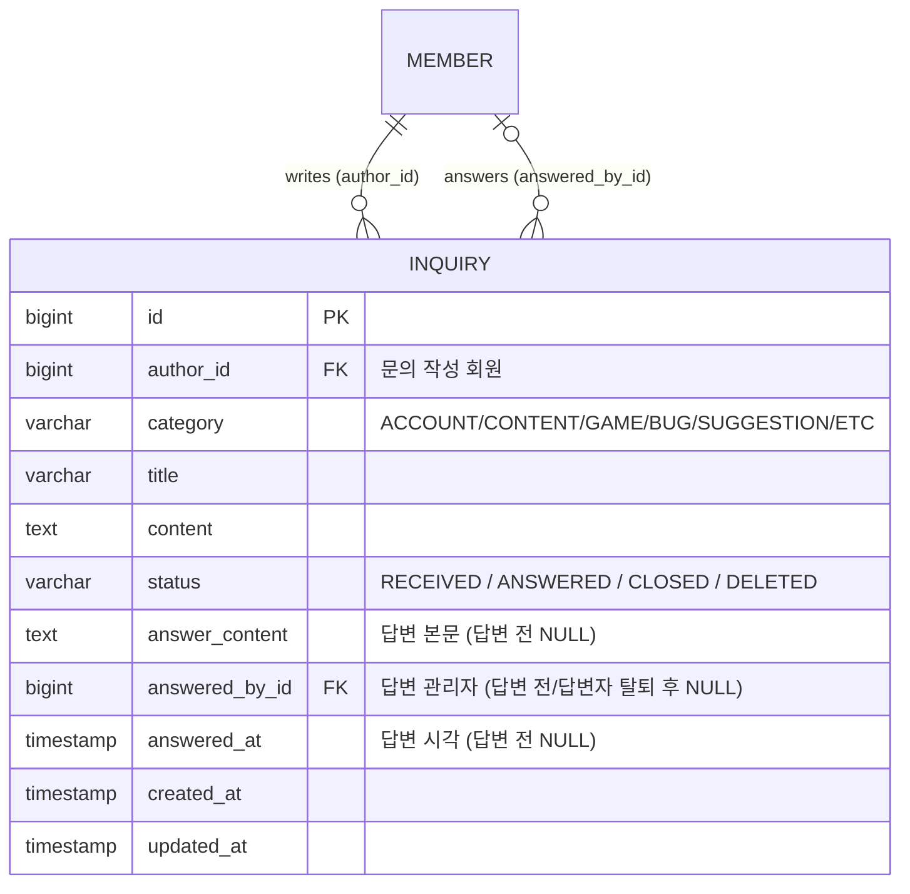

# Q&A — 1:1 문의(질의응답)

## 1. 기능 목적

회원이 서비스 이용 중 겪는 문제(로그인·콘텐츠 오류·게임 버그·건의 등)를 **비공개로 운영진에게 직접 질의**하고,
**관리자가 답변**하는 1:1 문의 채널을 제공한다. 커뮤니티의 공개 질문(`PostType.QUESTION`)과 달리,
문의 내용과 답변은 **작성자 본인과 관리자에게만** 노출된다.

핵심 가치: **회원의 비공개 질문에 운영진이 1:1로 답변하는 고객지원 창구를 제공한다.**

설계 원칙(확정):
- **비공개 1:1** — 문의·답변은 작성자와 관리자만 열람한다. 회원은 자신의 문의만 조회한다.
- **단일 답변(MVP)** — 질문 1건 + 관리자 답변 1건(엔티티 임베드). 회원의 추가 질문(왕복 대화)은 2차에서
  스레드(`InquiryMessage`)로 확장한다(12절).
- **상태 기반 흐름** — `접수(RECEIVED) → 답변완료(ANSWERED) → (선택)종료(CLOSED)`. 답변 전(`RECEIVED`)에만
  회원이 수정·삭제할 수 있다.
- **기존 패턴 재사용** — 헥사고날 모듈 구조, `BaseTimeEntity`, soft-delete, `JOIN FETCH` 리포지토리,
  `*ApiDocument` Swagger 분리, `ServiceError`/`ErrorType`, `PageResponse` 등 커뮤니티/회원 모듈의 패턴을 그대로 따른다.

> **성공 기준(수용 기준)**: 로그인 회원이 문의를 등록하면 "내 문의" 목록에 `접수` 상태로 나타나고,
> 다른 회원에게는 보이지 않는다. 관리자가 답변하면 상태가 `답변완료`로 바뀌고 회원 상세에서 답변을 확인할 수 있다.
> 답변 후에는 회원이 해당 문의를 수정·삭제할 수 없다.

---

## 2. 사용자 흐름

```
[회원]
홈/마이페이지 → "내 문의" 진입
  └─ "문의하기" → 카테고리 선택 + 제목/내용 작성 → 등록
       └─ 내 문의 목록에 "접수" 상태로 노출 (본인만)
            └─ (답변 전) 수정/삭제 가능
            └─ (답변 후) 상세에서 관리자 답변 확인, 수정/삭제 불가

[관리자]
관리자 콘솔 → Q&A(문의) 목록 (상태/카테고리/검색 필터)
  └─ 문의 상세 진입 → 답변 작성/수정 → 상태 "답변완료"
       └─ (선택) 처리 종료 시 "종료(CLOSED)"
```

- 문의 작성·조회는 **로그인 필수**다.
- 회원은 **자신의 문의만** 목록·상세에서 조회한다(타인 문의 접근 시 `INQUIRY_NOT_FOUND`).
- 답변은 **관리자만** 작성한다. 관리자는 모든 회원의 문의를 열람·답변한다.
- 답변 후 회원은 내용을 바꿀 수 없다(`INQUIRY_ALREADY_ANSWERED`). 정정이 필요하면 새 문의로 등록한다.

---

## 3. 데이터 모델 설계

### 3-1. 접근 방식

신규 **`qna` 모듈**(`com/elseeker/qna`)을 기존 헥사고날 구조 그대로 추가한다.

```
qna/
  adapter/input/api/client/   — 회원 문의 REST (InquiryApi + InquiryApiDocument)
  adapter/input/api/admin/    — 관리자 문의 REST (AdminInquiryApi + AdminInquiryApiDocument)
  adapter/input/web/          — SSR 뷰 컨트롤러 (회원 내문의 / 관리자 콘솔)
  adapter/output/jpa/         — InquiryRepository
  application/service/        — InquiryService(회원) / AdminInquiryService(관리자)
  application/mapper/         — InquiryMapper (toSummary/toDetail/toAdminItem)
  domain/model/               — Inquiry
  domain/vo/                  — InquiryStatus, InquiryCategory
```

문의(질문)와 관리자 답변은 **단일 엔티티 `Inquiry`에 임베드**한다(MVP). 답변 컬럼(`answer_content`,
`answered_by_id`, `answered_at`)은 답변 전까지 `NULL`이며, 답변 시 채워진다. 왕복 대화가 필요해지면 2차에서
`InquiryMessage` 자식 테이블을 도입한다(12절).

### 3-2. ERD



### 3-3. 엔티티안 (`qna/domain/model/Inquiry.kt`)

`BaseTimeEntity`(공통 `id` IDENTITY + `createdAt`/`updatedAt`)를 상속하고, 도메인 메서드에 권한/상태 가드를
둔다(커뮤니티 `Comment.kt`의 `ensureEditableBy`/`deleteBy`/`changeStatusByAdmin` 패턴 차용).

```kotlin
@Entity
@Table(
    name = "qna_inquiry",
    indexes = [
        Index(name = "idx_inquiry_author_created_at", columnList = "author_id, created_at"),
        Index(name = "idx_inquiry_status_created_at",  columnList = "status, created_at"),
    ]
)
class Inquiry(
    id: Long? = null,

    @ManyToOne(fetch = FetchType.LAZY)
    @JoinColumn(name = "author_id", nullable = false)
    val author: Member,

    @Enumerated(EnumType.STRING)
    @Column(name = "category", nullable = false)
    var category: InquiryCategory,

    @Column(name = "title", nullable = false, length = 200)
    var title: String,

    @Column(name = "content", nullable = false, columnDefinition = "TEXT")
    var content: String,

    @Enumerated(EnumType.STRING)
    @Column(name = "status", nullable = false)
    var status: InquiryStatus = InquiryStatus.RECEIVED,

    @Column(name = "answer_content", columnDefinition = "TEXT")
    var answerContent: String? = null,

    @ManyToOne(fetch = FetchType.LAZY)
    @JoinColumn(name = "answered_by_id")
    var answeredBy: Member? = null,

    @Column(name = "answered_at")
    var answeredAt: Instant? = null,

    createdAt: Instant = Instant.now(),
    updatedAt: Instant = Instant.now(),
) : BaseTimeEntity(id = id, createdAt = createdAt, updatedAt = updatedAt) {

    companion object {
        fun create(author: Member, category: InquiryCategory, title: String, content: String) =
            Inquiry(author = author, category = category, title = title, content = content,
                    status = InquiryStatus.RECEIVED)
    }

    val hasAnswer: Boolean get() = answeredAt != null && !answerContent.isNullOrBlank()
    val isAnswered: Boolean get() = hasAnswer

    // ── 회원(작성자) 행위 ── 답변 전(RECEIVED)에만 허용
    fun updateByAuthor(actor: Member, category: InquiryCategory, title: String, content: String) {
        ensureAuthor(actor)
        ensureModifiable()
        this.category = category; this.title = title; this.content = content
    }

    fun deleteByAuthor(actor: Member) {
        ensureAuthor(actor)
        ensureModifiable()
        this.status = InquiryStatus.DELETED   // soft-delete
    }

    // ── 관리자 행위 ──
    fun answer(actor: Member, content: String) {
        ensureAdmin(actor)
        ensureAnswerable()
        this.answerContent = content
        this.answeredBy = actor
        this.answeredAt = Instant.now()
        this.status = InquiryStatus.ANSWERED
    }

    fun updateAnswer(actor: Member, content: String) {
        ensureAdmin(actor)
        if (status == InquiryStatus.DELETED) throwError(ErrorType.INQUIRY_NOT_FOUND, "inquiryId=$id")
        if (!hasAnswer) throwError(ErrorType.INQUIRY_NOT_ANSWERED, "inquiryId=$id")
        this.answerContent = content
    }

    fun changeStatusByAdmin(actor: Member, target: InquiryStatus) {
        ensureAdmin(actor)
        // 관리자 상태 변경은 답변된 문의의 종료/재개만 허용. 최초 답변은 answer()로, 삭제는 회원 경로로 일원화.
        if (target !in setOf(InquiryStatus.CLOSED, InquiryStatus.ANSWERED)) {
            throwError(ErrorType.INVALID_STATUS_TRANSITION)
        }
        if (status == InquiryStatus.DELETED) throwError(ErrorType.INQUIRY_NOT_FOUND, "inquiryId=$id")
        if (!hasAnswer || status !in setOf(InquiryStatus.ANSWERED, InquiryStatus.CLOSED)) {
            throwError(ErrorType.INQUIRY_NOT_ANSWERED, "inquiryId=$id")
        }
        if (status == target) return
        this.status = target          // ANSWERED ↔ CLOSED (종료 / 재개)
    }

    private fun ensureModifiable() {
        if (!status.isModifiable()) throwError(ErrorType.INQUIRY_ALREADY_ANSWERED, "inquiryId=$id")
    }

    private fun ensureAnswerable() {
        if (status != InquiryStatus.RECEIVED) {
            throwError(ErrorType.INVALID_STATUS_TRANSITION, "inquiryId=$id,status=$status")
        }
    }

    private fun ensureAuthor(actor: Member) {
        if (author.id != actor.id) {
            throwError(ErrorType.INQUIRY_ACCESS_DENIED, "inquiryId=$id")
        }
    }

    private fun ensureAdmin(actor: Member) {
        if (actor.memberRole != MemberRole.ADMIN) throwError(ErrorType.ADMIN_ACCESS_DENIED)
    }
}
```

- **soft-delete**: 회원의 문의 삭제는 `status = DELETED`로 처리하고 목록/상세 조회에서 제외한다(커뮤니티 댓글과 일관).
  물리 삭제 경로는 두지 않는다.
- **답변자(`answeredBy`)**: 어느 관리자가 답변했는지 감사·표시용으로 보관한다(관리자 콘솔에서만 노출).

### 3-4. DDL (PostgreSQL 17 기준)

> 운영 DB는 `ddl-auto: none`이므로 아래 마이그레이션을 수동 적용한다. 로컬/테스트(H2)는 JPA가 스키마(컬럼 +
> `@Index`)를 자동 생성한다. 구현 시 `docs/qna/ddl/qna_inquiry.sql`로 분리 저장한다(`site_visit_event.sql` 포맷).

```sql
-- =====================================================================
-- qna_inquiry
-- 1:1 문의(질의응답) 테이블 — 회원 질문 + 관리자 단일 답변(임베드)
-- 설계 문서: docs/qna/qna-design.md
-- 대상 DB: PostgreSQL 17
-- =====================================================================

CREATE TABLE IF NOT EXISTS qna_inquiry (
    id              BIGINT       GENERATED BY DEFAULT AS IDENTITY PRIMARY KEY,
    author_id       BIGINT       NOT NULL,
    category        VARCHAR(20)  NOT NULL,
    title           VARCHAR(200) NOT NULL,
    content         TEXT         NOT NULL,
    status          VARCHAR(20)  NOT NULL,
    answer_content  TEXT         NULL,
    answered_by_id  BIGINT       NULL,
    answered_at     TIMESTAMP(6) NULL,
    created_at      TIMESTAMP(6) NOT NULL,
    updated_at      TIMESTAMP(6) NOT NULL,
    CONSTRAINT fk_inquiry_author      FOREIGN KEY (author_id)      REFERENCES member (id),
    CONSTRAINT fk_inquiry_answered_by FOREIGN KEY (answered_by_id) REFERENCES member (id) ON DELETE SET NULL
);

COMMENT ON TABLE  qna_inquiry                 IS '1:1 문의(질의응답)';
COMMENT ON COLUMN qna_inquiry.author_id       IS '문의 작성 회원 (member.id)';
COMMENT ON COLUMN qna_inquiry.category        IS '문의 카테고리 (ACCOUNT/CONTENT/GAME/BUG/SUGGESTION/ETC)';
COMMENT ON COLUMN qna_inquiry.status          IS '상태 (RECEIVED/ANSWERED/CLOSED/DELETED)';
COMMENT ON COLUMN qna_inquiry.answer_content  IS '관리자 답변 본문 (답변 전 NULL)';
COMMENT ON COLUMN qna_inquiry.answered_by_id  IS '답변 관리자 (member.id, 답변 전/답변자 탈퇴 후 NULL)';
COMMENT ON COLUMN qna_inquiry.answered_at     IS '답변 시각 (답변 전 NULL)';

-- =====================================================================
-- 인덱스
-- =====================================================================

-- 내 문의 목록 (작성자별 최신순)
CREATE INDEX IF NOT EXISTS idx_inquiry_author_created_at
    ON qna_inquiry (author_id, created_at);

-- 관리자 목록 (상태별 최신순)
CREATE INDEX IF NOT EXISTS idx_inquiry_status_created_at
    ON qna_inquiry (status, created_at);
```

`author_id`는 문의 보존을 위해 회원 탈퇴 트랜잭션에서 탈퇴 센티넬 계정으로 재지정한다. `answered_by_id`는
nullable 감사 필드이므로 답변자 탈퇴 시 `NULL` 처리한다(서비스 `clearAnswerer` + 운영 DB `ON DELETE SET NULL` 보조 안전장치).

---

## 4. 상태 모델 & 전이

`qna/domain/vo/InquiryStatus.kt` — `MemberRole` 패턴처럼 표시 명칭을 함께 둔다.

| 상태 | 의미 | 전이 주체 |
|------|------|-----------|
| `RECEIVED` | 접수 — 답변 대기 | 회원 등록 시 시작 |
| `ANSWERED` | 답변완료 | 관리자 `answer()` |
| `CLOSED` | 종료 — 추가 처리 없음 | 관리자 `changeStatusByAdmin(CLOSED)` |
| `DELETED` | 삭제(soft) — 목록/상세 제외 | 회원 `deleteByAuthor()` (RECEIVED에서만) |

```kotlin
enum class InquiryStatus(val title: String) {
    RECEIVED("접수"), ANSWERED("답변완료"), CLOSED("종료"), DELETED("삭제");

    /** 회원에게 노출되는 상태(삭제 제외). */
    fun isVisibleToMember(): Boolean = this != DELETED
    /** 회원이 수정/삭제할 수 있는 상태(답변 전). */
    fun isModifiable(): Boolean = this == RECEIVED
}
```

전이 규칙:
- `RECEIVED → ANSWERED` (관리자 답변), `ANSWERED ↔ CLOSED` (관리자 종료/재개).
- 관리자 상태 변경 API는 **이미 답변된 문의의 종료/재개만** 처리한다. 답변 없는 `RECEIVED → CLOSED`,
  답변 작성 없이 `RECEIVED → ANSWERED`, `DELETED` 상태 변경은 모두 금지한다.
- `RECEIVED → DELETED` (회원 삭제). **답변 후(`ANSWERED`/`CLOSED`) 회원 삭제 불가** — `INQUIRY_ALREADY_ANSWERED`.
- 모든 목록/상세 조회는 `status <> DELETED` 조건을 적용한다.

`qna/domain/vo/InquiryCategory.kt`:

```kotlin
enum class InquiryCategory(val title: String) {
    ACCOUNT("계정/로그인"), CONTENT("성경/콘텐츠"), GAME("게임"),
    BUG("오류/버그"), SUGGESTION("제안/건의"), ETC("기타");
}
```

---

## 5. 리포지토리 설계 (`qna/adapter/output/jpa/InquiryRepository.kt`)

커뮤니티 `CommentRepository`의 `JOIN FETCH` + `findAdminPage(countQuery)` 패턴을 그대로 따른다.

| 메서드 | 용도 | 비고 |
|--------|------|------|
| `findPageByAuthorId(authorId, excludedStatus, status, pageable): Page<Inquiry>` | 내 문의 목록 | 목록 응답은 작성자 필드를 쓰지 않으므로 fetch join 불필요. `status<>DELETED`, `(:status IS NULL OR status=:status)`, `ORDER BY createdAt DESC`, `countQuery` 명시 |
| `findByIdAndAuthorId(id, authorId, excludedStatus): Inquiry?` | 내 문의 상세/소유 검증 | `JOIN FETCH author LEFT JOIN FETCH answeredBy`, `status<>DELETED` |
| `findByIdWithAuthorAndAnswerer(id, excludedStatus): Inquiry?` | 관리자 상세 / 변이 대상 로드 | `JOIN FETCH author LEFT JOIN FETCH answeredBy`, `status<>DELETED` |
| `findAdminPage(excludedStatus, status, category, keyword, author, pageable): Page<Inquiry>` | 관리자 목록 | `DELETED` 제외 + 동적 필터 + `countQuery`(아래) |
| `reassignAuthor(memberId, sentinel): Int` | 회원 탈퇴 시 작성자 익명 재지정 | `@Modifying`, 커뮤니티와 동일 정책(문의 보존) |
| `clearAnswerer(memberId): Int` | 회원 탈퇴 시 답변자 참조 제거 | `@Modifying`, 답변 본문/시각은 보존하고 `answeredBy`만 `NULL` 처리 |

```kotlin
@Query(
    value = """
    SELECT i FROM Inquiry i
    WHERE i.author.id = :authorId
      AND i.status <> :excludedStatus
      AND (:status IS NULL OR i.status = :status)
    ORDER BY i.createdAt DESC
    """,
    countQuery = """
    SELECT count(i) FROM Inquiry i
    WHERE i.author.id = :authorId
      AND i.status <> :excludedStatus
      AND (:status IS NULL OR i.status = :status)
    """
)
fun findPageByAuthorId(
    @Param("authorId") authorId: Long,
    @Param("excludedStatus") excludedStatus: InquiryStatus,
    @Param("status") status: InquiryStatus?,
    pageable: Pageable,
): Page<Inquiry>

@Query(
    """
    SELECT i FROM Inquiry i
    JOIN FETCH i.author
    LEFT JOIN FETCH i.answeredBy
    WHERE i.id = :id
      AND i.author.id = :authorId
      AND i.status <> :excludedStatus
    """
)
fun findByIdAndAuthorId(
    @Param("id") id: Long,
    @Param("authorId") authorId: Long,
    @Param("excludedStatus") excludedStatus: InquiryStatus,
): Inquiry?

@Query(
    """
    SELECT i FROM Inquiry i
    JOIN FETCH i.author
    LEFT JOIN FETCH i.answeredBy
    WHERE i.id = :id
      AND i.status <> :excludedStatus
    """
)
fun findByIdWithAuthorAndAnswerer(
    @Param("id") id: Long,
    @Param("excludedStatus") excludedStatus: InquiryStatus,
): Inquiry?

@Query(
    value = """
    SELECT i FROM Inquiry i
    JOIN FETCH i.author
    LEFT JOIN FETCH i.answeredBy
    WHERE i.status <> :excludedStatus
      AND (:status   IS NULL OR i.status = :status)
      AND (:category IS NULL OR i.category = :category)
      AND (:keyword  IS NULL OR i.title LIKE :keyword OR i.content LIKE :keyword)
      AND (:author   IS NULL OR i.author.nickname LIKE :author)
    ORDER BY i.createdAt DESC
    """,
    countQuery = """
    SELECT count(i) FROM Inquiry i
    WHERE i.status <> :excludedStatus
      AND (:status   IS NULL OR i.status = :status)
      AND (:category IS NULL OR i.category = :category)
      AND (:keyword  IS NULL OR i.title LIKE :keyword OR i.content LIKE :keyword)
      AND (:author   IS NULL OR i.author.nickname LIKE :author)
    """
)
fun findAdminPage(
    @Param("excludedStatus") excludedStatus: InquiryStatus,   // 항상 InquiryStatus.DELETED 전달
    @Param("status") status: InquiryStatus?,
    @Param("category") category: InquiryCategory?,
    @Param("keyword") keyword: String?,
    @Param("author") author: String?,
    pageable: Pageable,
): Page<Inquiry>

@Modifying
@Query("UPDATE Inquiry i SET i.author = :sentinel WHERE i.author.id = :memberId")
fun reassignAuthor(@Param("memberId") memberId: Long, @Param("sentinel") sentinel: Member): Int

@Modifying
@Query("UPDATE Inquiry i SET i.answeredBy = NULL WHERE i.answeredBy.id = :memberId")
fun clearAnswerer(@Param("memberId") memberId: Long): Int
```

> **enum 비교는 `:param`으로 전달**한다 — 코드베이스 JPQL 관례(`CommentRepository.findByIdAndStatusNotForUpdate`·
> `PostRepository.findByIdAndStatusNot`의 `status <> :excludedStatus`)와 일치시키고 FQN enum 리터럴(`InquiryStatus.DELETED`)을 본문에 박지 않는다.
> `findPageByAuthorId`/`findByIdAndAuthorId`의 `DELETED` 제외도 동일하게 `:excludedStatus` 파라미터로 전달한다.
> `keyword`/`author`는 서비스에서 `"%$it%"`로 감싸 전달한다(`CommentService.getAdminComments` 패턴).
> `Page` 반환 쿼리는 fetch join 여부와 무관하게 `countQuery`를 명시해 Spring Data JPA의 자동 count 생성 실패를
> 피한다. 정렬은 JPQL `ORDER BY i.createdAt DESC`로 고정한다.

---

## 6. 서비스 설계

회원 조회는 `JwtPrincipal.memberUid`(UUID) → `memberRepository.findByUid(memberUid)`로 해석한다
(`CommentService.getMemberOrThrow` 패턴). 트랜잭션은 조회 `@Transactional(readOnly = true)`,
변이 `@Transactional`로 분리한다.

### 6-1. `InquiryService` (회원)

```kotlin
@Service
class InquiryService(
    private val inquiryRepository: InquiryRepository,
    private val memberRepository: MemberRepository,
) {
    @Transactional
    fun createInquiry(memberUid: UUID, req: CreateInquiryRequest): InquiryDetailResponse {
        val member = getMemberOrThrow(memberUid)
        val saved = inquiryRepository.save(
            Inquiry.create(member, req.category, req.title, req.content)
        )
        return saved.toDetail(viewerId = member.id)
    }

    @Transactional(readOnly = true)
    fun getMyInquiries(memberUid: UUID, status: InquiryStatus?, pageable: Pageable): PageResponse<InquirySummaryResponse> {
        val member = getMemberOrThrow(memberUid)
        val page = inquiryRepository.findPageByAuthorId(member.id!!, InquiryStatus.DELETED, status, pageable)
        return PageResponse.from(page) { it.toSummary() }
    }

    @Transactional(readOnly = true)
    fun getMyInquiryDetail(memberUid: UUID, inquiryId: Long): InquiryDetailResponse {
        val member = getMemberOrThrow(memberUid)
        val inquiry = inquiryRepository.findByIdAndAuthorId(inquiryId, member.id!!, InquiryStatus.DELETED)
            ?: throwError(ErrorType.INQUIRY_NOT_FOUND, "inquiryId=$inquiryId")
        return inquiry.toDetail(viewerId = member.id)
    }

    @Transactional
    fun updateInquiry(memberUid: UUID, inquiryId: Long, req: UpdateInquiryRequest): InquiryDetailResponse {
        val member = getMemberOrThrow(memberUid)
        val inquiry = inquiryRepository.findByIdAndAuthorId(inquiryId, member.id!!, InquiryStatus.DELETED)
            ?: throwError(ErrorType.INQUIRY_NOT_FOUND, "inquiryId=$inquiryId")
        inquiry.updateByAuthor(member, req.category, req.title, req.content)   // RECEIVED 가드 내장
        return inquiry.toDetail(viewerId = member.id)
    }

    @Transactional
    fun deleteInquiry(memberUid: UUID, inquiryId: Long) {
        val member = getMemberOrThrow(memberUid)
        val inquiry = inquiryRepository.findByIdAndAuthorId(inquiryId, member.id!!, InquiryStatus.DELETED)
            ?: throwError(ErrorType.INQUIRY_NOT_FOUND, "inquiryId=$inquiryId")
        inquiry.deleteByAuthor(member)   // soft-delete, RECEIVED 가드 내장
    }

    private fun getMemberOrThrow(memberUid: UUID) =
        memberRepository.findByUid(memberUid) ?: throwError(ErrorType.MEMBER_NOT_FOUND)
}
```

> **소유 검증은 쿼리로 강제**한다(`findByIdAndAuthorId`). 타인 문의 id를 알아도 조회·수정·삭제 모두
> `INQUIRY_NOT_FOUND`(존재하지 않는 것으로 취급)로 막는다. 도메인의 `ensureAuthor`는 2차 방어선이며,
> 작성자 수정/삭제에 관리자 예외를 두지 않는다.

### 6-2. `AdminInquiryService` (관리자)

```kotlin
@Service
class AdminInquiryService(
    private val inquiryRepository: InquiryRepository,
    private val memberRepository: MemberRepository,
) {
    @Transactional(readOnly = true)
    fun getAdminInquiries(status: InquiryStatus?, category: InquiryCategory?, keyword: String?, author: String?, pageable: Pageable): Page<Inquiry> {
        val kw = keyword?.trim()?.takeIf { it.isNotBlank() }?.let { "%$it%" }
        val au = author?.trim()?.takeIf { it.isNotBlank() }?.let { "%$it%" }
        return inquiryRepository.findAdminPage(
            excludedStatus = InquiryStatus.DELETED,
            status = status, category = category, keyword = kw, author = au,
            pageable = PageRequest.of(pageable.pageNumber, pageable.pageSize),
        )
    }

    @Transactional(readOnly = true)
    fun getAdminInquiryDetail(inquiryId: Long): Inquiry =
        inquiryRepository.findByIdWithAuthorAndAnswerer(inquiryId, InquiryStatus.DELETED)
            ?: throwError(ErrorType.INQUIRY_NOT_FOUND, "inquiryId=$inquiryId")

    @Transactional
    fun answerInquiry(memberUid: UUID, inquiryId: Long, content: String) {
        val admin = getMemberOrThrow(memberUid)
        val inquiry = getAdminInquiryDetail(inquiryId)
        inquiry.answer(admin, content)        // RECEIVED → ANSWERED
    }

    @Transactional
    fun updateAnswer(memberUid: UUID, inquiryId: Long, content: String) {
        val admin = getMemberOrThrow(memberUid)
        getAdminInquiryDetail(inquiryId).updateAnswer(admin, content)
    }

    @Transactional
    fun changeStatus(memberUid: UUID, inquiryId: Long, status: InquiryStatus) {
        val admin = getMemberOrThrow(memberUid)
        getAdminInquiryDetail(inquiryId).changeStatusByAdmin(admin, status)
    }

    private fun getMemberOrThrow(memberUid: UUID) =
        memberRepository.findByUid(memberUid) ?: throwError(ErrorType.MEMBER_NOT_FOUND)
}
```

---

## 7. API 설계

### 7-1. 엔드포인트

**회원** — `/api/v1/qna/inquiries` (전부 인증 필요, `@AuthenticationPrincipal JwtPrincipal` → `memberUid`)

| 동작 | 메서드 · 경로 | 요청 본문 | 응답 |
|------|----------------|-----------|------|
| 문의 등록 | `POST /api/v1/qna/inquiries` | `CreateInquiryRequest` | `201` + `InquiryDetailResponse` |
| 내 문의 목록 | `GET /api/v1/qna/inquiries?status=&page=&size=` | — | `PageResponse<InquirySummaryResponse>` |
| 내 문의 상세 | `GET /api/v1/qna/inquiries/{id}` | — | `InquiryDetailResponse` |
| 문의 수정(답변 전) | `PUT /api/v1/qna/inquiries/{id}` | `UpdateInquiryRequest` | `InquiryDetailResponse` |
| 문의 삭제(답변 전) | `DELETE /api/v1/qna/inquiries/{id}` | — | `204` |

**관리자** — `/api/v1/admin/qna/inquiries` (SecurityConfig `/api/v1/admin/**` → `hasRole("ADMIN")` 자동 적용)

| 동작 | 메서드 · 경로 | 요청 본문 | 응답 |
|------|----------------|-----------|------|
| 문의 목록 | `GET /api/v1/admin/qna/inquiries?status=&category=&keyword=&author=` | — | `AdminPageResponse<AdminInquiryItem>` |
| 문의 상세 | `GET /api/v1/admin/qna/inquiries/{id}` | — | `AdminInquiryItem` |
| 답변 작성 | `POST /api/v1/admin/qna/inquiries/{id}/answer` | `AnswerInquiryRequest` | `200` |
| 답변 수정 | `PUT /api/v1/admin/qna/inquiries/{id}/answer` | `AnswerInquiryRequest` | `200` |
| 상태 변경(종료/재개) | `PATCH /api/v1/admin/qna/inquiries/{id}/status` | `AdminInquiryStatusRequest` | `200` |

- 컨트롤러는 `@Validated`(클래스) + `@Valid`(본문), Swagger 애너테이션은 `InquiryApiDocument`/`AdminInquiryApiDocument`
  인터페이스로 분리한다(프로젝트 컨벤션). 회원 컨트롤러는 `CommunityApi`처럼 `principal.memberUid`를 서비스로 전달.
- 관리자 상태 변경 API는 `ANSWERED ↔ CLOSED` 전용이다. 최초 답변 등록은 반드시 답변 작성 API(`POST /answer`)를
  통해서만 수행한다.
- 에러 코드: 미존재/타인 문의 → `INQUIRY_NOT_FOUND`, 답변 후 회원 수정/삭제 → `INQUIRY_ALREADY_ANSWERED`,
  비관리자 답변 시도(이중 방어) → `ADMIN_ACCESS_DENIED`.

### 7-2. 요청/응답 DTO

`CommunityRequests.kt`의 `@field:NotBlank/@field:Size/@field:Schema` 스타일, 목록은 `PageResponse`/`AdminPageResponse.from`.

```kotlin
// ── 요청 (qna/adapter/input/api/client/request) ──
@Schema(description = "1:1 문의 등록 요청")
data class CreateInquiryRequest(
    @field:NotNull val category: InquiryCategory,
    @field:NotBlank @field:Size(max = 200) val title: String,
    @field:NotBlank @field:Size(max = 4000) val content: String,
)
data class UpdateInquiryRequest(/* category, title, content — Create와 동일 제약 */)

// ── 관리자 요청 (qna/adapter/input/api/admin/request) ──
data class AnswerInquiryRequest(@field:NotBlank @field:Size(max = 4000) val content: String)
data class AdminInquiryStatusRequest(@field:NotNull val status: InquiryStatus)

// ── 응답 (client/response) ──
@Schema(description = "내 문의 목록 항목")
data class InquirySummaryResponse(
    val id: Long, val category: InquiryCategory, val title: String,
    val status: InquiryStatus, val isAnswered: Boolean,
    val createdAt: Instant, val answeredAt: Instant?,
)

@Schema(description = "문의 상세 (문의 + 답변)")
data class InquiryDetailResponse(
    val id: Long, val category: InquiryCategory, val title: String, val content: String,
    val status: InquiryStatus, val isAuthor: Boolean,
    val answerContent: String?, val answeredAt: Instant?,
    val createdAt: Instant, val updatedAt: Instant,
)

// ── 관리자 응답 (admin/response) — 작성자/답변자 식별 포함 ──
@Schema(description = "관리자 문의 항목")
data class AdminInquiryItem(
    val id: Long, val category: InquiryCategory, val title: String, val content: String,
    val status: InquiryStatus, val authorNickname: String,
    val answerContent: String?, val answeredByNickname: String?, val answeredAt: Instant?,
    val createdAt: Instant,
)
```

매퍼(`InquiryMapper.kt`)는 `toSummary()`/`toDetail(viewerId)`/`toAdminItem()` 확장 함수로 둔다(`CommentMapper` 패턴).
`isAuthor`는 `author.id == viewerId`로 계산한다.

---

## 8. 화면 방향

### 8-1. 회원 — "내 문의"

**목록 / 작성·수정 / 상세를 3개의 독립 화면으로 분리**한다(인라인 폼·모달이 아님). `MemberWebController`에 라우트를
추가한다(기존 `redirectIfUnauthenticated` 패턴, 리터럴 `new`·`{id}/edit`가 `{id}`보다 우선 매칭).

| 화면 | 라우트 | 뷰 | JS |
|------|--------|-----|-----|
| 목록 | `GET /web/member/my-inquiries` | `member/my-inquiries` | `js/member/my-inquiries.js` |
| 작성 | `GET /web/member/my-inquiries/new` | `member/my-inquiry-form` | `js/member/my-inquiry-form.js` |
| 수정 | `GET /web/member/my-inquiries/{id}/edit` | `member/my-inquiry-form` | `js/member/my-inquiry-form.js` |
| 상세 | `GET /web/member/my-inquiries/{id}` | `member/my-inquiry-detail` | `js/member/my-inquiry-detail.js` |

- **목록**: 상태 탭(전체/접수/답변완료/종료) + 카드 목록(카테고리·상태 배지·제목·작성일) + 스켈레톤·빈 상태·무한 스크롤.
  "문의하기"는 **작성 화면 링크**(`/web/member/my-inquiries/new`)다(상단 액션 + 빈 상태 CTA). 카드 클릭 → 상세.
- **작성·수정(폼)**: 단독 폼 화면(공용). 카테고리 select + 제목(`max 200`)·내용(`max 4000`) **실시간 글자수 카운터** +
  인라인 검증. URL로 모드 판별 — `/new`=생성(POST), `/{id}/edit`=수정(PUT, 로드 후 프리필; **`RECEIVED`가 아니면 수정 불가
  안내·복귀**). 제출 성공 시 `location.replace()`로 상세로 이동(폼을 히스토리에서 제거 → 상세의 뒤로가기가 폼이 아닌
  목록/이전 화면으로 향함).
- **상세**: 질문(배지·제목·작성일·내용) + 관리자 답변(없으면 "답변 대기 중", 있으면 본문 + 답변일). **작성자 본인이고
  `RECEIVED`일 때만** "수정"(→ `/{id}/edit` 링크)·"삭제"(confirm → DELETE → 목록) 노출. 하단에 "목록으로" 버튼,
  상단 네비 백버튼은 폼(`/new`·`/{id}/edit`)에서 진입한 경우 목록으로 이동(아니면 `history.back()`).
- 공통 CSS `css/member/my-inquiries.css`(3화면 공유, 테마 변수 + 다크 오버라이드). **목록 화면만** `css/search.css`를
  추가 로드(스크롤-투-top 위젯). CSS/JS 수정 시 참조 템플릿의 `?v=` 쿼리 파라미터를 올린다. API 호출은
  `fetchWithAuthRetry`(`common-util.js`), 인증은 `checkAuthStatus`(`auth/auth-check.js`)로 401 시 로그인 리다이렉트.
- 진입점: 헤더 계정 메뉴(`fragments/header.html`의 `#topNavAccountMenu`)에 "내 문의" 링크(`#topNavMyInquiryLink`)를
  마이페이지 인근에 추가하고, 인라인 헤더 스크립트의 `onAuthenticated`에서 `d-none`을 제거한다(`myMemoLink`와 동일 패턴).
- 활성 메뉴 표시는 서버 주입 `currentPath`(`GlobalModelAttribute`) + `th:classappend` 방식(클라이언트 `location.pathname` 금지).

### 8-2. 관리자 — Q&A 콘솔

- `AdminQnaWebController`(`@RequestMapping("/web/admin/qna")`) → `GET /inquiries`(목록), `GET /inquiries/{id}`(상세+답변 폼).
- 템플릿은 **기능별 하위 디렉토리 관례**(`admin/community/admin-community-post-list.html`)에 맞춰
  `admin/qna/admin-inquiry-list.html`·`admin/qna/admin-inquiry-detail.html`로 둔다. 기존 관리자 목록 화면
  (`admin/bible/...`·`admin/community/...`)의 topbar → breadcrumb → title → toolbar(상태/카테고리/검색 필터)
  → table + 반응형 카드 구조를 차용.
- 상세에서 답변 작성/수정, 상태 종료/재개를 수행한다. 답변자(`answeredByNickname`)·답변 시각을 표시.

---

## 9. 도메인 규칙 / 권한 / 엣지 케이스

- **소유 검증(회원)**: 모든 회원 조회/수정/삭제는 `findByIdAndAuthorId`로 본인 소유만 처리. 타인 id → `INQUIRY_NOT_FOUND`.
- **작성자 행위 제한**: 회원 수정/삭제 도메인 메서드는 작성자 본인만 허용한다. 관리자는 답변/상태 변경 전용 경로를 사용한다.
- **답변 전 가드**: 회원 수정/삭제는 `RECEIVED`에서만. 답변 후 → `INQUIRY_ALREADY_ANSWERED`(엔티티 `ensureModifiable`).
- **답변/상태 전이 가드**: `answer()`는 `RECEIVED`에서만 가능하고, 상태 변경은 답변이 존재하는 `ANSWERED`/`CLOSED`
  문의의 종료/재개만 가능하다.
- **관리자 전용 답변**: 답변/답변수정/상태변경은 `hasRole("ADMIN")`(URL 레벨) + `ensureAdmin`(도메인 레벨) 이중 방어.
- **soft-delete 일관성**: `DELETED`는 모든 조회 쿼리에서 제외(`status <> DELETED`). 물리 삭제 경로 없음.
- **회원 탈퇴 처리**: `MemberService.deleteMember` 트랜잭션에 Q&A 참조 정리를 포함한다. 작성자는
  `reassignAuthor(memberId, sentinel)`로 탈퇴 센티넬 계정에 벌크 재지정해 문의를 보존하고(FK 안전, 행 미삭제),
  답변자(`answeredBy`)는 `clearAnswerer(memberId)`로 `NULL` 처리한다. 답변 본문/답변 시각은 그대로 보존한다.
- **빈 검색어 처리**: `keyword`/`author`가 공백이면 서비스에서 `null` 처리해 `LIKE '%%'` 전체 스캔을 회피.
- **카운트/페이지네이션**: 관리자 목록은 `findAdminPage`의 `countQuery`로 `DELETED` 제외 총계를 정확히 계산.

---

## 10. 보안 설정 변경

- `SecurityConfig`의 `authorizeHttpRequests`에 회원 문의 API를 인증 필수로 추가:
  ```kotlin
  .requestMatchers("/api/v1/qna/**").authenticated()
  ```
  이 매처는 공개 API `permitAll` 묶음보다 앞에 둔다. 현재는 `anyRequest().authenticated()`가 최종 방어선이지만,
  Q&A API의 비공개 성격을 명시하고 향후 공개 매처 확장 시 회귀를 막기 위해 별도 규칙으로 둔다.
- 관리자 API/페이지는 기존 규칙으로 커버됨 — `"/web/admin/**", "/api/v1/admin/**"` → `hasRole("ADMIN")`
  (`/api/v1/admin/qna/**`, `/web/admin/qna/**` 포함).
- 회원 SSR 페이지 `/web/member/my-inquiries[/**]`는 컨트롤러 `redirectIfUnauthenticated`로 보호(기존 mypage 패턴).
  (`/web/**`가 기본 `permitAll`이므로 컨트롤러 가드가 인증 책임을 진다.)
- 인증 실패 시 API는 `401 JSON`, 웹은 `/web/auth/login?returnUrl=...` 리다이렉트(기존 entryPoint 동작 그대로).

`ErrorType` 추가 항목:

```kotlin
// 404
INQUIRY_NOT_FOUND(HttpStatus.NOT_FOUND, "문의를 찾을 수 없습니다.", LogLevel.WARN),
// 400
INQUIRY_ALREADY_ANSWERED(HttpStatus.BAD_REQUEST, "이미 답변이 등록된 문의는 수정·삭제할 수 없습니다.", LogLevel.WARN),
INQUIRY_NOT_ANSWERED(HttpStatus.BAD_REQUEST, "아직 답변이 등록되지 않은 문의입니다.", LogLevel.WARN),
// 403
INQUIRY_ACCESS_DENIED(HttpStatus.FORBIDDEN, "문의에 대한 접근 권한이 없습니다.", LogLevel.WARN),
```

---

## 11. 테스트 계획

- **단위(도메인)**: `answer()`가 `RECEIVED→ANSWERED` + 답변 필드 설정, `RECEIVED` 외 상태에서 회원 수정/삭제 차단
  (`INQUIRY_ALREADY_ANSWERED`), `RECEIVED` 외 상태에서 `answer()` 차단, 답변 없는 `CLOSED/ANSWERED` 상태 변경 차단,
  작성자 전용 수정/삭제(`ensureAuthor`)와 관리자 전용 답변(`ensureAdmin`) 가드.
- **통합(`IntegrationTest` 기반, Testcontainers)**:
  - 문의 등록 → 내 목록에 `RECEIVED`로 노출, `isAnswered=false`.
  - **타인 문의 비노출** — 다른 회원이 상세/수정/삭제 시 `INQUIRY_NOT_FOUND`.
  - 관리자 답변 → 상태 `ANSWERED`, 회원 상세에서 `answerContent` 확인.
  - 답변 후 회원 수정/삭제 시 `INQUIRY_ALREADY_ANSWERED`.
  - 회원이 문의를 삭제(soft-delete)한 뒤 내 목록·관리자 목록·총계에서 제외.
  - soft-delete된 문의를 관리자 상세/답변/상태 변경 대상으로 조회하면 `INQUIRY_NOT_FOUND`.
  - 답변 없는 문의를 상태 변경 API로 `CLOSED`/`ANSWERED` 처리하려 하면 실패.
  - 관리자 목록 필터(`status`/`category`/`keyword`/`author`) 동작, 페이지네이션 총계 정확성.
  - 비로그인 접근 시 `401`, 비관리자가 관리자 API 접근 시 `403`.
  - 회원 탈퇴 시 작성자 익명 재지정(문의 보존) + 답변자 참조 `NULL` 처리.
- **회귀**: 커뮤니티/회원 기존 기능에 영향 없음(신규 모듈이라 격리).

---

## 12. 구현 범위 제안

**1차 (MVP)**
- `qna` 모듈: `Inquiry` 엔티티, `InquiryStatus`/`InquiryCategory` VO, `InquiryRepository`.
- 서비스 `InquiryService`(회원) / `AdminInquiryService`(관리자).
- 회원 탈퇴 연동: `MemberService.deleteMember`에서 `InquiryRepository.reassignAuthor`/`clearAnswerer` 호출.
- 회원 API(`/api/v1/qna/inquiries`) + 관리자 API(`/api/v1/admin/qna/inquiries`) + `*ApiDocument`.
- DTO/매퍼, `ErrorType` 4종 추가, `SecurityConfig`에 `/api/v1/qna/**` 인증 규칙.
- 회원 "내 문의" 화면 — 목록 / 작성·수정(공용 폼) / 상세 **3개 화면 분리** + 헤더 진입점, 관리자 Q&A 콘솔.
- DDL(`docs/qna/ddl/qna_inquiry.sql`), 통합/단위 테스트(11절).

**2차**
- **왕복 스레드**: `InquiryMessage`(자식 테이블)로 회원 추가 질문 ↔ 관리자 재답변. `Inquiry`의 임베드 답변을
  첫 메시지로 마이그레이션.
- 답변 등록 시 회원 알림(이메일/인앱), "내 문의" 미확인 답변 배지.
- 첨부파일(스크린샷) 업로드.
- 자주 묻는 문의 → FAQ 자동/수동 전환.
- 답변자 변경 이력/감사 로그 강화.

---

## 부록. 결정 로그

| 항목 | 결정 |
|------|------|
| 기능 성격 | 1:1 비공개 문의(회원↔관리자) — 커뮤니티 공개 질문과 별개 모듈 |
| 모듈 | 신규 `qna` 헥사고날 모듈 |
| 답변 모델 | **단일 답변 임베드**(MVP). 왕복 스레드는 2차(`InquiryMessage`) |
| 상태 | `RECEIVED/ANSWERED/CLOSED/DELETED`, 회원 수정/삭제는 `RECEIVED`에서만 |
| 삭제 | **soft-delete**(`status=DELETED`), 조회 전부 제외 |
| 소유 검증 | 쿼리(`findByIdAndAuthorId`)로 강제 + 도메인 `ensureAuthor` 2차 방어(관리자 예외 없음) |
| 관리자 권한 | `/api/v1/admin/**` `hasRole(ADMIN)` + `ensureAdmin` 이중 방어 |
| 회원 식별 | `JwtPrincipal.memberUid` → `memberRepository.findByUid` |
| 목록/페이징 | `PageResponse`/`AdminPageResponse.from`, 관리자 `findAdminPage(countQuery)` |
| 탈퇴 회원 | 작성자는 `reassignAuthor` 센티넬 재지정(문의 보존), 답변자는 `clearAnswerer`로 NULL 처리 |
| 보안 라우팅 | `/api/v1/qna/**` 인증, `/web/member/my-inquiries` 컨트롤러 가드 |
